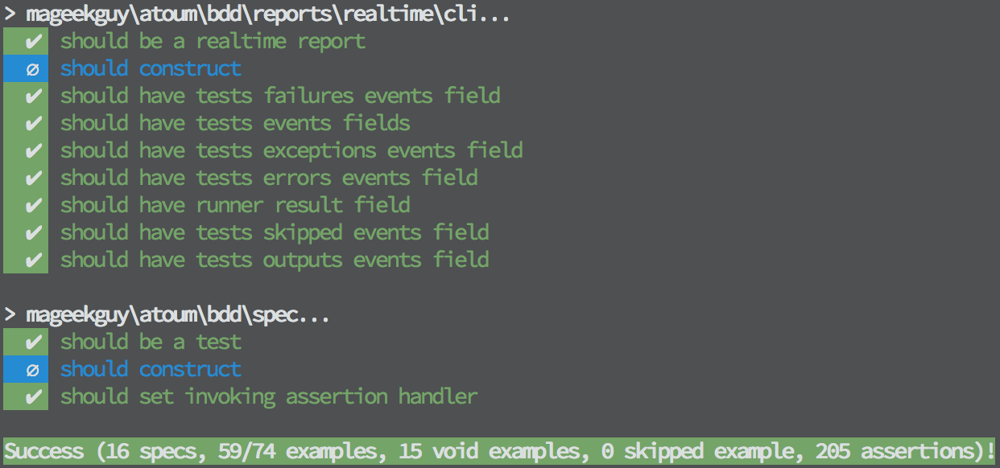

+++
title = "atoum has two release managers"
date = "2014-11-28"
[taxonomies]
keywords=["test", "atoum"]
+++

## What is atoum?

Short introduction: atoum is a simple, modern and intuitive unit testing
framework for PHP. Originally created by [Frédéric
Hardy](http://blog.mageekbox.net/), a good friend, it has grown thanks
to [many
contributors](https://github.com/atoum/atoum/graphs/contributors).

<figure>

  

  <figcaption>
  atoum's logo.
  </figcaption>

</figure>

No one can say that atoum is not simple or intuitive. The framework
offers several awesome features and is more like a meta unit testing
framework. Indeed, the “user-land” of atoum, I mean all the assertions
API (“this is an integer and it is equal to…”) is based on a very
flexible mechanism, handled or embedded in runners, reporters etc. Thus,
the framework is very extensible. You can find more informations in the
`README.md` of the project: [Why
atoum?](https://github.com/atoum/atoum#why-atoum).

Several important projects or companies use atoum. For instance,
[Pickle](https://github.com/FriendsOfPHP/pickle/), the PHP Extension
installer, created by [Pierre Joye](https://twitter.com/PierreJoye),
another friend (the world is very small 😉) use atoum for its unit
tests. Another example with [M6Web](https://github.com/M6Web), the geeks
working at [M6](https://en.wikipedia.org/wiki/M6_%28TV_channel%29), the
most profitable private national French TV channel, also use atoum.
Another example, [Mozilla](http://mozilla.org/) is using atoum to test
some of their applications.

## Where is the cap'tain?

Since the beginning, Frédéric has been a great leader for the project.
He has inspired many people, users and contributors. In real life, on
stage, on IRC… its personality and charisma were helpful in all aspects.
However, leading such a project is a challenging and nerve-wracking
daily work. I know what I am talking about with
[Hoa](http://hoa-project.net/). Hopefully for Frédéric, some
contributors were here to help.

## Where to go cap'tain?

However, having contributors do not create a community. A community is a
group of people that share something together. A project needs a
community with strong connections. They do no need to all look at the
same direction, but they have to share something. In the case of atoum,
I would say the project has been **victim of its own success**. We have
seen the number of users increasing very quickly and the project was not
yet ready for such a massive use. The documentation was not ready, a lot
of features were not finalized, there were few contributors and the
absence of a real community did not help. Put all these things together,
blend them together and you obtain a bomb 😄. The project leaders were
under a terrible pressure.

In these conditions, this is not easy to work. Especially when users ask
for new features. The needs to have a roadmap and people taking
decisions were very strong.

## When the community acts

After a couple of months under the sea, we have decided that we need to
create a structure around the project. An organization. Frédéric is not
able to do everything by himself. That's why **2 release managers have
been elected**: Mikaël Randy and I. Thank you to [Julien
Bianchi](http://jubianchi.fr/), another friend 😉, for having organized
these elections and being one of the most active contributor of atoum!

Our goal is to define the roadmap of atoum:

- what will be included in the next version and what will not,
- what features need work,
- what bugs or issues need to be solved,
- etc.

Well, a release manager is a pretty common job.

Why 2? To avoid the bus effect and delegate. We all have a family,
friends, jobs and side projects. With 2 release managers, we have
2 times more time to organize this project, and it deserves such an
amount of time.

The goal is also to organize the community if it is possible. New great
features are coming and they will allow more people to contribute and
build their “own atoum”. See below.

## Features to port!

Everything is not defined at 100% but here is an overview of what is
coming.

First of all, you will find the [latest issues and
bugs](https://github.com/atoum/atoum/milestones/1.0.0) we have to close
before the first release.

Second, you will notice the version number… 1.0.0. Yes! atoum will have
tags! After several discussions
([#261](https://github.com/atoum/atoum/issues/261),
[#300](https://github.com/atoum/atoum/issues/300),
[#342](https://github.com/atoum/atoum/issues/342),
[#349](https://github.com/atoum/atoum/issues/349)…), even if atoum is
rolling-released, it will have tags. And with the [semver
format](http://semver.org/). More informations on the blog of Julien
Bianchi: [atoum embraces semver](http://jubianchi.fr/atoum-release.htm).

Finally, a big feature is the [Extension
API](https://github.com/atoum/atoum/pull/330), that allows to write
extension, such as:

- [`atoum/visibility-extension`](https://github.com/atoum/visibility-extension),
  allows to override methods visibility; example:

``` php
class Foo {
    protected function bar($arg) {
        return $arg;
    }
}

// and…

class Foo extends atoum\test {
    public function testBaz() {
        $this
            ->if($sut = new \Foo())
            ->and($arg = 'bar')
            ->then
                ->variable($this->invoke($sut)->bar($arg))
                ->isEqualTo($arg);
    }
}
```

Now you will be able to test your protected and private methods!

- [`atoum/bdd-extension`](https://github.com/atoum/bdd-extension),
  allows to write tests with the behavior-driven development style and
  vocabulary; example:

``` php
class Formatter extends atoum\spec {
    public function should_format_underscore_separated_method_name() {
        $this
            ->given($formatter = new testedClass())
            ->then
                ->invoking->format(__FUNCTION__)->on($formatter)
                    ->shouldReturn('should format underscore separated method name');
    }
}
```

Even the output looks familiar:

<figure>

  
  
  <figcaption>
  Possible output with the `atoum/bdd-extension`.
  </figcaption>

</figure>

- [`atoum/json-schema-extension`](https://github.com/atoum/json-schema-extension),
  allows to validate JSON payloads against a schema; example:

``` php
class Foo extends atoum\test {
    public function testIsJson() {
        $this
            ->given($string = '{"foo": "bar"}')
            ->then
                ->json($string);
    }

    public function testValidatesSchema() {
        $this
            ->given($string = '["foo", "bar"]')
            ->then
                ->json($string)->validates('{"title": "test", "type": "array"}')
                ->json($string)->validates('/path/to/json.schema');
    }
}
```

- [`atoum/praspel-extension`](https://github.com/hoaproject/Contributions-Atoum-PraspelExtension),
  allows to use [Praspel](https://en.wikipedia.org/wiki/Praspel) inside
  atoum: automatically generate and validate advanced test data and unit
  tests; example:

``` php
class Foo extends atoum\test {
    public function testFoo() {
        $this
            ->if($regex  = $this->realdom->regex('/[\w\-_]+(\.[\w\-\_]+)*@\w\.(net|org)/'))
            ->and($email = $this->sample($regex))
            ->then
                …
    }
}
```

Here, we have generated a string based on its regular expression.
Reminder, you might have seen this on this blog: [Generate strings based
on regular
expressions](@/articles/2014-09-30-generate-strings-based-on-regular-expressions/index.md).

Fun fact: the `atoum/json-schema-extension` is tested with atoum
obviously and… `atoum/praspel-extension`!

## Conclusion

atoum has a bright future with exciting features! We sincerely hope this
new direction will gather existing and new contributors 😄.

❤️ open-source!
