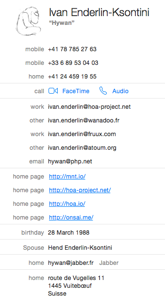
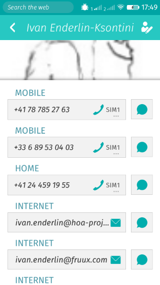
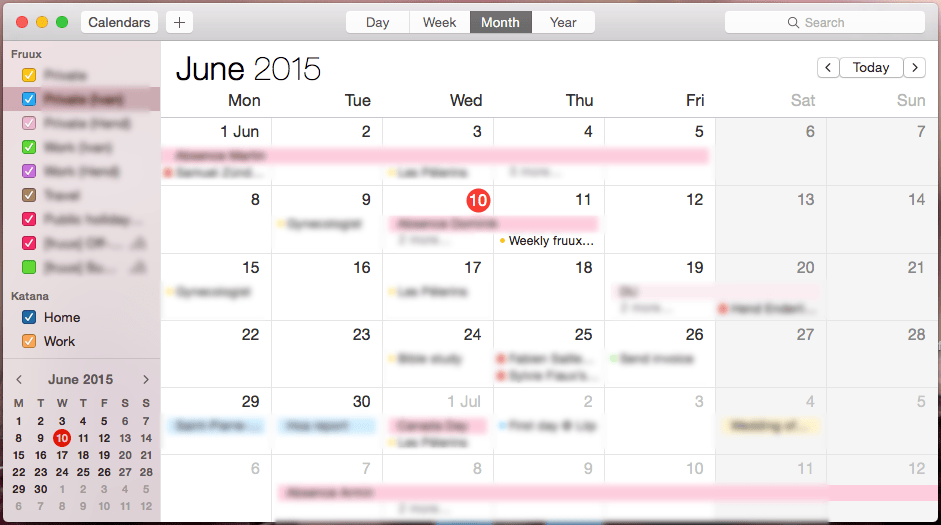
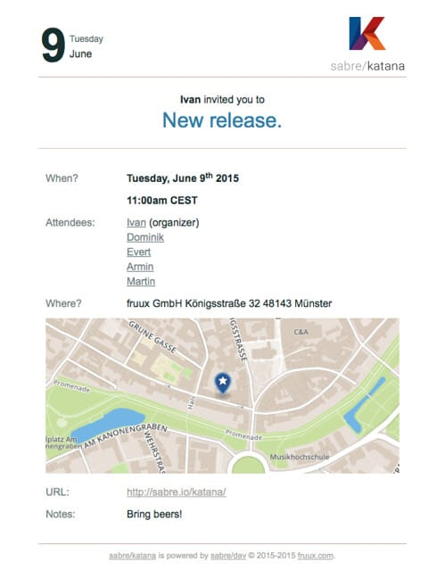
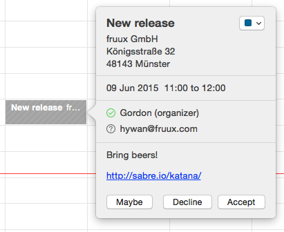
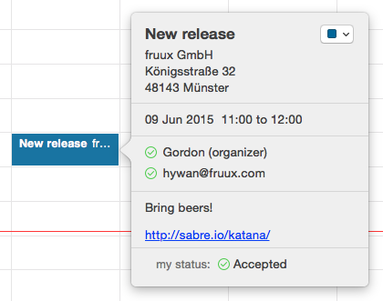
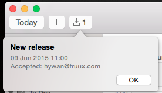
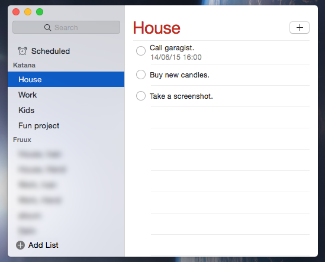
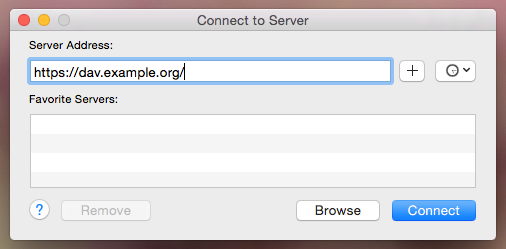
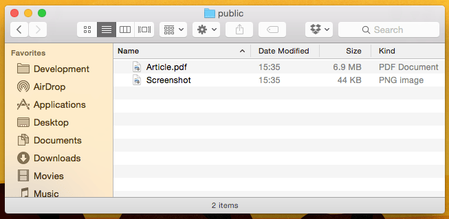

+++
title = "sabre/katana"
date = "2015-07-13"
[taxonomies]
keywords=["fruux", "caldav", "carddav", "webdav"]
+++

<figure>

  

  <figcaption>

  Project's logo.

  </figcaption>

</figure>

## What is it?

`sabre/katana` is a contact, calendar, task list and file server. What
does it mean? Assuming nowadays you have multiple devices (PC, phones,
tablets, TVs…). If you would like to get your address books, calendars,
task lists and files synced between all these devices from everywhere,
you need a server. All your devices are then considered as clients.

But there is an issue with the server. Most of the time, you might
choose [Google](https://google.com/) or maybe
[Apple](https://apple.com/), but one may wonder: Can we trust these
servers? Can we give them our private data, like all our contacts, our
calendars, all our photos…? What if you are a company or an association
and you have sensitive data that are really private or strategic? So,
can you still trust them? Where the data are stored? Who can look at
these data? More and more, there is a huge need for “personal” server.

Moreover, servers like Google or Apple are often closed: You reach your
data with specific clients and they are not available in all platforms.
This is for strategic reasons of course. But with `sabre/katana`, you
are not limited. See the above schema: Firefox OS can talk to iOS or
Android at the same time.

`sabre/katana` is this kind of server. You can install it on your
machine and manage users in a minute. Each user will have a collection
of address books, calendars, task lists and files. This server can talk
to a [loong list of devices](https://fruux.com/supported-devices/),
mainly thanks to a scrupulous respect of industrial standards:

- macOS:
  - OS X 10.10 (Yosemite),
  - OS X 10.9 (Mavericks),
  - OS X 10.8 (Mountain Lion),
  - OS X 10.7 (Lion),
  - OS X 10.6 (Snow Leopard),
  - OS X 10.5 (Leopard),
  - BusyCal,
  - BusyContacts,
  - Fantastical,
  - Rainlendar,
  - ReminderFox,
  - SoHo Organizer,
  - Spotlife,
  - Thunderbird ,
- Windows:
  - eM Client,
  - Microsoft Outlook 2013,
  - Microsoft Outlook 2010,
  - Microsoft Outlook 2007,
  - Microsoft Outlook with Bynari WebDAV Collaborator,
  - Microsoft Outlook with iCal4OL,
  - Rainlendar,
  - ReminderFox,
  - Thunderbird,
- Linux:
  - Evolution,
  - Rainlendar,
  - ReminderFox,
  - Thunderbird,
- Mobile:
  - Android,
  - BlackBerry 10,
  - BlackBerry PlayBook,
  - Firefox OS,
  - iOS 8,
  - iOS 7,
  - iOS 6,
  - iOS 5,
  - iOS 4,
  - iOS 3,
  - Nokia N9,
  - Sailfish.

Did you find your device in this list? Probably yes 😉.

`sabre/katana` sits in the middle of all your devices and synced all
your data. Of course, it is **free** and **open source**. [Go check the
source](https://github.com/fruux/sabre-katana/)!

## List of features

Here is a non-exhaustive list of features supported by `sabre/katana`.
Depending whether you are a user or a developer, the features that might
interest you are radically not the same. I decided to show you a list
from the user point of view. If you would like to get a list from the
developer point of view, please see this [exhaustive list of supported
RFC](http://sabre.io/dav/standards-support/) for more details.

### Contacts

All usual fields are supported, like phone numbers, email addresses,
URLs, birthday, ringtone, texttone, related names, postal addresses,
notes, HD photos etc. Of course, groups of cards are also supported.

<figure>

  

  <figcaption>

  My card inside the native Contact application of macOS.

  </figcaption>

</figure>

<figure>

  

  <figcaption>

  My card inside the native Contact application of Firefox OS.

  </figcaption>

</figure>

My photo is not in HD, I really have to update it!

Cards can be encoded into several formats. The most usual format is VCF.
`sabre/katana` allows you to download the whole address book of a user
as a single VCF file. You can also create, update and delete address
books.

### Calendars

A calendar is just a set of events. Each event has several properties,
such as a title, a location, a date start, a date end, some notes, URLs,
alarms etc. `sabre/katana` also support recurring events (“each last
Monday of the month, at 11am…”), in addition to scheduling (see bellow).

<figure>

  

  <figcaption>

  My calendars inside the native Calendar application of macOS.

  </figcaption>

</figure>

<figure>

  

  <figcaption>

  My calendars inside the native Calendar application of Firefox OS.

  </figcaption>

</figure>

Few words about calendar scheduling. Let's say you are organizing an
event, like New release (we always enjoy release day!). You would like
to invite several people but you don't know if they could be present or
not. In your event, all you have to do is to add attendees. How are they
going to be notified about this event? Two situations:

1.  Either attendees are registered on your `sabre/katana` server and
    they will receive an invite inside their calendar application (we
    call this iTIP),
2.  Or they are not registered on your server and they will receive an
    email with the event as an attached file (we call this iMIP). All
    they have to do is to open this event in their calendar application.

<figure>

  

  <figcaption>

  Invite an attendee by email because she is not registered on your
  `sabre/katana` server.

  </figcaption>

</figure>

Notice the gorgeous map embedded inside the email!

Once they received the event, they can accept, decline or “don't know”
(they will try to be present at) the event.

<figure>

  

  <figcaption>

  Receive an invite to an event. Here: Gordon is inviting Hywan. Three
  choices for Hywan:

  </figcaption>

</figure>

<figure>

  

  <figcaption>

  Hywan has accepted the event. Here is what the event looks like. Hywan
  can see the response of each attendees.

  </figcaption>

</figure>

<figure>

  

  <figcaption>

  Gordon is even notified that Hywan has accepted the event.

  </figcaption>

</figure>

Of course, attendees will be notified too if the event has been moved,
canceled, refreshed etc.

Calendars can be encoded into several formats. The most usal format is
ICS. `sabre/katana` allows you to download the whole calendar of a user
as a single ICS file. You can also create, update and delete calendars.

### Task lists

A task list is exactly like a calendar (from a programmatically point of
view). Instead of containg event objects, it contains todo objects.

`sabre/katana` supports group of tasks, reminder, progression etc.

<figure>

  

  <figcaption>

  My task lists inside the native Reminder application of macOS.

  </figcaption>

</figure>

Just like calendars, task lists can be encoded into several formats,
whose ICS. `sabre/katana` allows you to download the whole task list of
a user as a single ICS file. You can also create, update and delete task
lists.

### Files

Finally, `sabre/katana` creates a home collection per user: A personal
directory that can contain files and directories and… synced between all
your devices (as usual 😄).

`sabre/katana` also creates a special directory called `public/` which
is a public directory. Every files and directories stored inside this
directory are accessible to anyone that has the correct link. No listing
is prompted to protect your public data.

Just like contact, calendar and task list applications, you need a
client application to connect to your home collection on `sabre/katana`.

  <figure>

  

  <figcaption>

  Connect to a server with the Finder application of macOS.

  </figcaption>

</figure>

Then, your public directory on `sabre/katana` will be a regular
directory as every other.

<figure>

  

  <figcaption>

  List of my files, right here in the Finder application of macOS.

  </figcaption>

</figure>

`sabre/katana` is able to store any kind of files. Yes, any kinds. It's
just files. However, it white-lists the kind of files that can be showed
in the browser. Only images, audios, videos, texts, PDF and some vendor
formats (like Microsoft Office) are considered as safe (for the server).
This way, associations can share musics, videos or images, companies can
share PDF or Microsoft Word documents etc. Maybe in the future
`sabre/katana` might white-list more formats. If a format is not
white-listed, the file will be forced to download.

## How is `sabre/katana` built?

`sabre/katana` is based on two big and solid projects:

1.  [`sabre/dav`](http://sabre.io/),
2.  [Hoa](http://hoa-project.net/).

`sabre/dav` is one of the most powerful
[CardDAV](https://en.wikipedia.org/wiki/CardDAV),
[CalDAV](https://en.wikipedia.org/wiki/CalDAV) and
[WebDAV](https://en.wikipedia.org/wiki/WebDAV) framework in the planet.
Trusted by the likes of [Atmail](https://www.atmail.com/),
[Box](https://www.box.com/blog/in-search-of-an-open-source-webdav-solution/),
[fruux](https://fruux.com/) and [ownCloud](http://owncloud.org/), it
powers millions of users world-wide! It is written in PHP and is open
source.

Hoa is a modular, extensible and structured set of PHP libraries. Fun
fact: Also open source, this project is also trusted by
[ownCloud](http://owncloud.org/), in addition to
[Mozilla](http://mozilla.org/), [joliCode](http://jolicode.com/) etc.
Recently, this project has recorded more than 600,000 downloads and the
community is about to reach 1000 people.

`sabre/katana` is then a program based on `sabre/dav` for the DAV part
and Hoa for everything else, like the logic code inside the
`sabre/dav`'s plugins. The result is a ready-to-use server with a nice
interface for the administration.

To ensure code quality, we use [atoum](http://atoum.org/), a popular and
modern test framework for PHP. So far, `sabre/dav` has more than
1000 assertions.

## Conclusion

`sabre/katana` is a server for contacts, calendars, task lists and
files. Everything is synced, everytime and everywhere. It perfectly
connects to a lot of devices on the market. Several features we need and
use daily have been presented. This is the easiest and a secure way to
host your own private data.

[Go download it](https://github.com/fruux/sabre-katana)!
