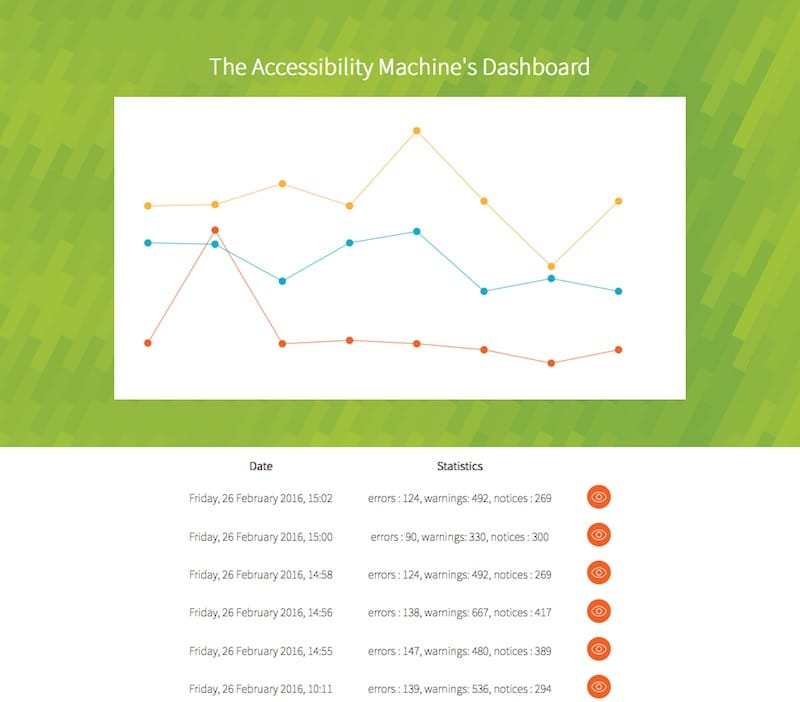
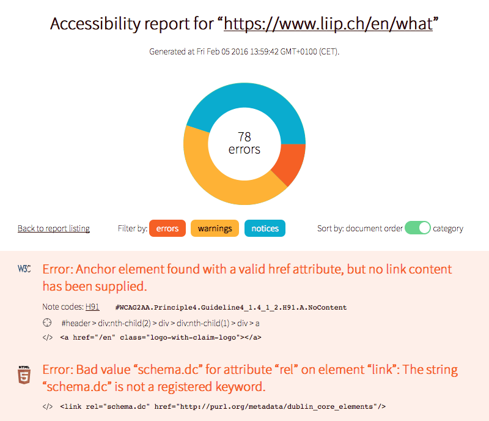

+++
title = "Bye bye Liip, hello Automattic"
date = "2017-04-18"
description = "Eh, new job!"
[taxonomies]
keywords=["job"]
+++

Since April 2017, I have left [Liip](https://www.liip.ch/) to join
[Automattic](https://automattic.com/).

# Bye bye Liip

After almost 20 months at Liip, I am leaving. Liip was a great
experience. It was my first industrial non-remote job. It was also my
first job in the country I am currently living in. And I have discovered
a new way of working.

## First industrial non-remote job

Before working for Liip, I was working for [fruux](https://fruux.com/).
My situation was the following: A french citizen, living as a foreigner
in Switzerland, working for a German company, with employees from
Germany, Holland, and Canada. Everything happened on chat, mail, and
Skype. When my son was born, I had to change my work to simplify my
life. It was not the only reason, but one of them.

And before fruux, I was working for [INRIA](https://www.inria.fr/en/), a
research institute in France. It was partially a remote job.

Liip has several offices. I was based in Lausanne.

So, yes, Liip was my first industrial non-remote job. And I liked it.
Working in the train on the morning, walking in Lausanne, seeing real
people, everything in my local language. Because yes, it was my first
job in my native language too.

Everything was simpler. And when you have your first baby, anything else
that is simpler saves your life.

## Introducing Holacracy

Giant discussions were happening to remove any form of hierarchy in
Liip. Then we discovered
[Holacracy](https://en.wikipedia.org/wiki/Holacracy), and we started
moving to this system. This is a new governance system. If you are
familiar with distributed network topologies in Computer Science, or
data structures, it really looks like a [Distributed Spanning
Tree](https://hal.archives-ouvertes.fr/hal-00560821/document)
\[[DahanPN09](http://dblp.org/rec/html/journals/tpds/DahanPN09)\]. Note:
I am sure that the authors of Holacracy are not aware of DST, but, eh.

So nothing new from a research point of view, but it is cool to see this
algorithm coming alive in real life. And it worked: Less meetings, more
self-organisation, more shared responsabilities, no more “boss” etc.
This is not a tool for all companies, but I am sure that if you are
reading my blog, then your company should give it a try.

## Open source projects

Liip has been very generous with me regarding my open source
engagements. I was involved in [Hoa](https://hoa-project.net/),
[atoum](https://atoum.org/), and
[Pickle](https://github.com/FriendsOfPHP/pickle) when joining the
company. Liip gave me a 5% budget, so roughly 1 hour per day to work on
Hoa. Thank you for that!

After that, I have started a new big project, called [Tagua
VM](https://github.com/tagua-vm/tagua-vm). They gave me an additional 5%
budget. So I got 2 hours per day to work on Hoa and Tagua VM. Again, thank
you for that!

Finally, I have started an in-house open project called [The A11y
Machine](https://github.com/liip/TheA11yMachine) (a11ym for short). I
have written a case study for this tool on the Liip's blog:
[Accessibility: make your website barrier-free with
a11ym!](https://blog.liip.ch/archive/2016/12/06/accessibility-with-a11ym.html)

The goal of a11ym is to automate the accessibility testing of any site
by crawling and testing each page. A sweet report is generated, showing
all errors, warnings, and notices, with all information needed by the
developer to fix the issues as fast as possible.

<figure>

  

  <figcaption>

  Dashboard of a11ym, showing the evolution of the accessibility of a site
  in time

  </figcaption>

</figure>

<figure>

  

  <figcaption>

  A typical a11ym report listing all errors, warnings, and notices for a
  given URL

  </figcaption>

</figure>

This project has received really good feedbacks from the accessibility
community. It has been downloaded 7000 times so far, which is not bad
considering the niche it targets.

A new SaaS platform is being build around this software. I enjoyed
working on it, and it was really tangible.

## Main customer, huge project

Liip is a Web agency, so you have dozens of customers at the same time.
However, I was in a special team for an important customer. The site is
a luxury watches and jewellery e-commerce platform, located in several
countries, in 10 languages, accessible from 16 domains, shared in 2
datacenters. This is not a casual site.

I learned a lot about all the complexity such a site brings: Checkout
rules (oh damned…), product catalogs in different formats for different
countries with different references, all the business logic inherent to
each country, different payment providers, crazy front end
compatibilities etc.

I have a hundred of crazy anecdotes to tell. This was clearly not a job
for me at first glance: I am a researcher, I have an open source culture
background, I am not tailored for this kind of project. But at the end
of the story, I learned a lot. Really a lot. I have a better overview of
the crazy things any customer can ask, or has to deal with, and the
infrastructure craziness that can be set up. I learned how to make
better things: How to transform a really crappy software into something
understandable by everyone, how to not break a 10+ years old progam with
no test etc. And it requires skills. I learned it the hard way, but I
learned it.

## Why leaving?

Because even if I learned during my time at Liip, the Web agency model
was definitively not for me. I am very thankful to every Liiper, I had a
great time, I love the Web, but not in an agency.

My son is now 21 months old, and I need fresh air. I can take new
challenges.

# Welcome Automattic

[Automattic](https://automattic.com/) is the company behind
[WordPress.com](https://wordpress.com/),
[WooCommerce](https://woocommerce.com/),
[Akismet](https://akismet.com/), [Simplenote](https://simplenote.com/),
[Cloudup](https://cloudup.com/), [Simperium](https://simperium.com),
[Gravatar](http://en.gravatar.com/) and other giant services.

I came to Automattic by coincidence. I was looking for a sponsor for
Tagua VM, and someone pointed me out Automattic. After some researches
about the company, it appears that it could be a really great place
where to work. So I applied.

The hiring process was 4 months long. It was exhausting because it
happened at the same time than a big sprint at Liip (remember the SaaS
platform for The A11y Machine?). But after 4 months, it appears I
succeeded, and I am very glad of that fact!

I am just starting my job at Automattic. I don't have anything strong
and finite to say now, apart that everything is just awesome so far. In
few weeks, I am likely to write about my start at Automattic I did, see
[Welcome to Chaos](@/articles/2017-04-24-welcome-to-chaos/index.md). They
have a very interesting way to get you on board.

Time for a new adventure!
