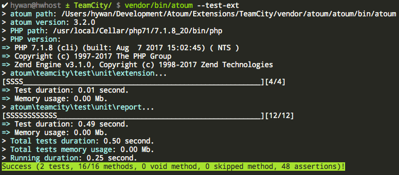
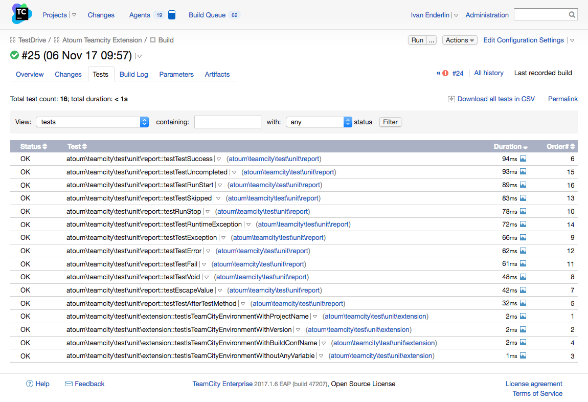

+++
title = "atoum supports TeamCity"
date = "2017-11-06"
description = "[atoum](http://atoum.org) gains a new extension: `atoum/teamcity-extension` to get full integration with [TeamCity](https://www.jetbrains.com/teamcity/)!"
[taxonomies]
keywords=["test", "atoum"]
+++

[atoum](http://atoum.org/) is a popular PHP test framework.
[TeamCity](https://www.jetbrains.com/teamcity/) is a Continuous
Integration and Continuous Delivery software developed by Jetbrains.
Despites [atoum supports many industry
standards](http://atoum.org/features.html#reports) to report test
execution verdicts, TeamCity uses [its own non-standard
report](https://confluence.jetbrains.com/display/TCD8/Build+Script+Interaction+with+TeamCity),
and thus atoum is not compatible with TeamCity… until now.

The `atoum/teamcity-extension` provides TeamCity support inside atoum.
When executing tests, the reported verdicts are understandable by
TeamCity, and activate all its UI features.

## Install

If you have Composer, just run:

```console
$ composer require atoum/teamcity-extension '~1.0'
```

From this point, you need to enable the extension in your `.atoum.php`
configuration file. The following example forces to enable the extension
for every test execution:

```php
<?php

$extension = new atoum\teamcity\extension($script);
$extension->addToRunner($runner);
```

The following example enables the extension **only within** a TeamCity
environment:

```php
<?php

$extension = new atoum\teamcity\extension($script);
$extension->addToRunnerWithinTeamCityEnvironment($runner);
```

This latter installation is recommended. That's it 🙂.

## Glance

The default CLI report looks like this:

<figure>

  

  <figcaption>

  The default CLI report is the default one from atoum.

  </figcaption>

</figure>

The TeamCity report looks like this in your terminal (note the
`TEAMCITY_VERSION` variable as a way to emulate a TeamCity environment):

<figure>

  

  <figcaption>

  The TeamCity report is text-based, but it is aimed at being consumed by a
  formatter to produce HTML.

  </figcaption>

</figure>

Which is less easy to read. However, when it comes into TeamCity UI, we
will have the following result:

<figure>

  

  <figcaption>

  The final rendering, at an HTML document inside TeamCity itself.

  </figcaption>

</figure>

We are using it at [Automattic](https://automattic.com/). Hope it is
useful for someone else!

If you find any bugs, or would like any other features, please use
Github at the following repository:
[https://github.com/Hywan/atoum-teamcity-extension/](https://github.com/Hywan/atoum-teamcity-extension/).
