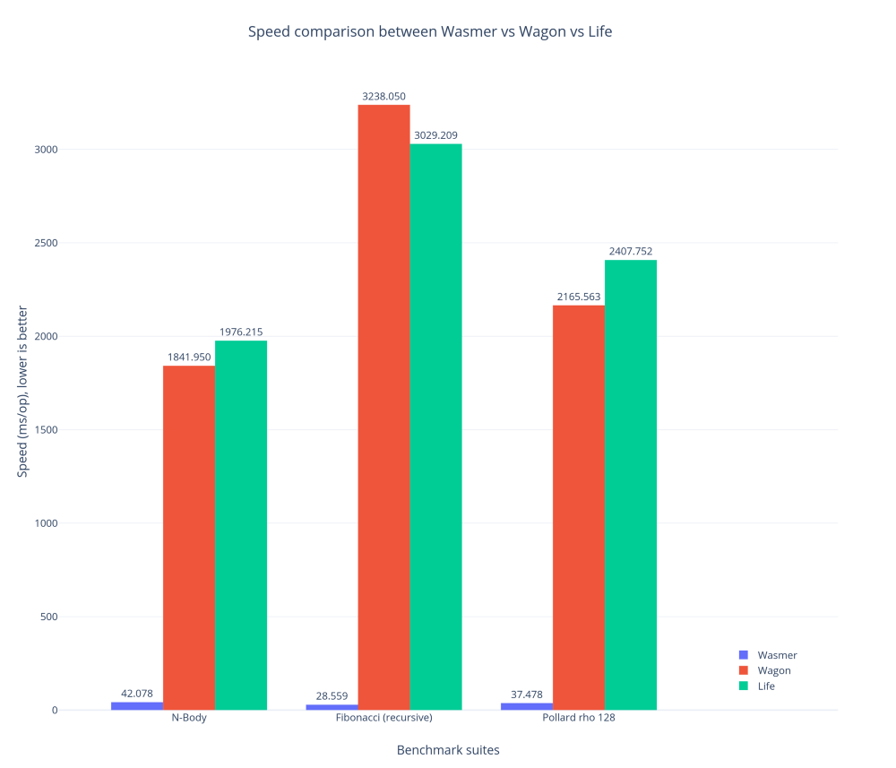

+++
title = "Announcing the fastest WebAssembly runtime for Go: wasmer"
date = "2019-05-29"
[taxonomies]
keywords=["rust", "webassembly", "go", "runtime", "binding"]
+++

*This is a copy of [an article I wrote for
Wasmer](https://medium.com/wasmer/announcing-the-fastest-webassembly-runtime-for-go-wasmer-19832d77c050).*

------------------------------------------------------------------------

WebAssembly is a portable binary format. That means the same file can
run anywhere.

> To uphold this bold statement, each language, platform and system must
> be able to run WebAssembly — as fast and safely as possible.

[Wasmer](https://github.com/wasmerio/wasmer) is a WebAssembly runtime
written in [Rust](https://www.rust-lang.org/). It goes without saying
that the runtime can be used in any Rust application. We have also
successfully embedded the runtime in other languages:

- Using [C and C++
  bindings](https://github.com/wasmerio/wasmer/tree/master/lib/runtime-c-api)
- In PHP, using
  [`php-ext-wasm`](https://github.com/wasmerio/php-ext-wasm)
- In Python, using
  [`python-ext-wasm`](https://github.com/wasmerio/python-ext-wasm) —
  [wasmer package on PyPI](https://pypi.org/project/wasmer/)
- In Ruby, using
  [`ruby-ext-wasm`](https://github.com/wasmerio/ruby-ext-wasm) — [wasmer
  gem on RubyGems](https://rubygems.org/gems/wasmer)
- **It is now time to hang around [Go](https://golang.org/)
  🐹!**

We are super happy to announce `github.com/wasmerio/go-ext-wasm/wasmer`,
a [Go library to run WebAssembly binaries,
fast](https://github.com/wasmerio/go-ext-wasm).

# Calling a WebAssembly function from Go

First, let’s install `wasmer` in your go environment (*with cgo
support*).

```sh
export CGO_ENABLED=1; export CC=gcc; go install github.com/wasmerio/go-ext-wasm/wasmer
```

Let’s jump immediately into some
examples.`github.com/wasmerio/go-ext-wasm/wasmer` is a regular Go
library. The installation is automated with
`import "github.com/wasmerio/go-ext-wasm/wasmer"`.

Let’s get our hands dirty. We will write a program that compiles to
WebAssembly easily, using Rust for instance:

```rust
#[no_mangle]
pub extern fn sum(x: i32, y: i32) -> i32 {
    x + y
}
```

After compilation to WebAssembly, we get a file like [this
one](https://github.com/wasmerio/go-ext-wasm/blob/master/wasmer/test/testdata/examples/simple.wasm),
named `simple.wasm`.  
The following Go program executes the `sum` function by passing `5` and
`37` as arguments:

```go
package main

import (
    "fmt"
    wasm "github.com/wasmerio/go-ext-wasm/wasmer"
)

func main() {
    // Reads the WebAssembly module as bytes.
    bytes, _ := wasm.ReadBytes("simple.wasm")
    
    // Instantiates the WebAssembly module.
    instance, _ := wasm.NewInstance(bytes)
    defer instance.Close()

    // Gets the `sum` exported function from the WebAssembly instance.
    sum := instance.Exports["sum"]

    // Calls that exported function with Go standard values. The WebAssembly
    // types are inferred and values are casted automatically.
    result, _ := sum(5, 37)

    fmt.Println(result) // 42!
}
```

Great! We have successfully executed a WebAssembly file inside Go.

> *Note: Go values passed to the WebAssembly exported function are
> automatically cast to WebAssembly values. Types are inferred and
> casting is done automatically. Thus, a WebAssembly function acts as
> any regular Go function.*

# WebAssembly calling Go funtions

A WebAssembly module *exports* some functions, so that they can be
called from the outside world. This is the entry point to execute
WebAssembly.

Nonetheless, a WebAssembly module can also have *imported* functions.
Let’s consider the following Rust program:

```rust
extern {
    fn sum(x: i32, y: i32) -> i32;
}

#[no_mangle]
pub extern fn add1(x: i32, y: i32) -> i32 {
    unsafe { sum(x, y) } + 1
}
```

The exported function `add1` calls the `sum` function. Its
implementation is absent, only its signature is defined. This is an
“extern function”, and for WebAssembly, this is an *imported* function,
because its implementation must be *imported*.

Let’s implement the `sum` function in Go! To do so, *need* to use
[cgo](https://blog.golang.org/c-go-cgo):

1.  The `sum` function signature is defined in C (see the comment above
    `import "C"`),
2.  The `sum` implementation is defined in Go. Notice the `//export`
    which is the way cgo uses to map Go code to C code,
3.  `NewImports` is an API used to create WebAssembly imports. In this
    code `"sum"` is the WebAssembly imported function name, `sum` is the
    Go function pointer, and `C.sum` is the cgo function pointer,
4.  Finally, `NewInstanceWithImports` is the constructor to use to
    instantiate the WebAssembly module with imports. That’s it.

Let’s see the complete program:

```go
package main

// // 1️⃣ Declare the `sum` function signature (see cgo).
//
// #include <stdlib.h>
//
// extern int32_t sum(void *context, int32_t x, int32_t y);
import "C"

import (
    "fmt"
    wasm "github.com/wasmerio/go-ext-wasm/wasmer"
    "unsafe"
)

// 2️⃣ Write the implementation of the `sum` function, and export it (for cgo).
//export sum
func sum(context unsafe.Pointer, x int32, y int32) int32 {
    return x + y
}

func main() {
    // Reads the WebAssembly module as bytes.
    bytes, _ := wasm.ReadBytes("import.wasm")

    // 3️⃣ Declares the imported functions for WebAssembly.
    imports, _ := wasm.NewImports().Append("sum", sum, C.sum)

    // 4️⃣ Instantiates the WebAssembly module with imports.
    instance, _ := wasm.NewInstanceWithImports(bytes, imports)

    // Close the WebAssembly instance later.
    defer instance.Close()

    // Gets the `add1` exported function from the WebAssembly instance.
    add1 := instance.Exports["add1"]

    // Calls that exported function.
    result, _ := add1(1, 2)

    fmt.Println(result)
    //   add1(1, 2)
    // = sum(1 + 2) + 1
    // = 1 + 2 + 1
    // = 4
    // QED
}
```

# Reading the memory

A WebAssembly instance has a linear memory. Let’s see how to read it.
Consider the following Rust program:

```rust
#[no_mangle]
pub extern fn return_hello() -> *const u8 {
    b"Hello, World!\0".as_ptr()
}
```

The `return_hello` function returns a pointer to a string. The string
terminates by a null byte, *à la* C. Let’s jump on the Go side:

```go
bytes, _ := wasm.ReadBytes("memory.wasm")
instance, _ := wasm.NewInstance(bytes)
defer instance.Close()

// Calls the `return_hello` exported function.
// This function returns a pointer to a string.
result, _ := instance.Exports["return_hello"]()

// Gets the pointer value as an integer.
pointer := result.ToI32()

// Reads the memory.
memory := instance.Memory.Data()

fmt.Println(string(memory[pointer : pointer+13])) // Hello, World!
```

The `return_hello` function returns a pointer as an `i32` value. We get
its value by calling `ToI32`. Then, we fetch the memory data with
`instance.Memory.Data()`.

This function returns a slice over the WebAssembly instance memory. It
can be used as any regular Go slice.

Fortunately for us, we already know the length of the string we want to
read, so `memory[pointer : pointer+13]` is enough to read the bytes,
that are then cast to a string. *Et voilà !*

> You can read [the Greet
> Example](https://github.com/wasmerio/go-ext-wasm/blob/6934a0fa06558f77884398a2371de182593e6a6c/wasmer/test/example_greet_test.go)
> to see a more advanced usage of the memory API.

# Benchmarks

So far, `github.com/wasmerio/go-ext-wasm/wasmer` has a nice API, but
…*is it fast*?

Contrary to PHP or Ruby, there are already existing runtimes in the Go
world to execute WebAssembly. The main candidates are:

- [Life](https://github.com/perlin-network/life), from Perlin Network, a
  WebAssembly interpreter
- [Wagon](https://github.com/go-interpreter/wagon), from Go Interpreter,
  a WebAssembly interpreter and toolkit.

In [our blog post about the PHP
extension](https://medium.com/wasmer/php-ext-wasm-migrating-from-wasmi-to-wasmer-4d1014f41c88),
we have used [the n-body
algorithm](https://benchmarksgame-team.pages.debian.net/benchmarksgame/description/nbody.html)
to benchmark the performance. Life provides more benchmarks: [the
Fibonacci algorithm](https://en.wikipedia.org/wiki/Fibonacci_number)
(the recursive version), [the Pollard’s rho
algorithm](https://en.wikipedia.org/wiki/Pollard%27s_rho_algorithm), and
the Snappy Compress operation. The latter works successfully with
`github.com/wasmerio/go-ext-wasm/wasmer` but not with Life or Wagon. We
have removed it from the benchmark suites. [Benchmark
sources](https://github.com/wasmerio/go-ext-wasm/tree/master/benchmarks)
are online.

We use Life 20190521143330–57f3819c2df0, and Wagon 0.4.0, i.e. *the
latest versions to date*.

The benchmark numbers represent the average result for 10 runs each. The
computer that ran these benchmarks is a MacBook Pro 15" from 2016,
2.9Ghz Core i7 with 16Gb of memory.

Results are grouped by benchmark algorithm on the X axis. The Y axis
represents the time used to run the algorithm, expressed in
milliseconds. The lower, the better.

<figure>

  

  <figcaption>

  Speed comparison between Wasmer, Wagon and Life. Benchmark suites are
  the n-body, Fibonacci, and Pollard’s rho algorithms. Speed is expressed
  in ms. Lower is better.

  </figcaption>

</figure>

While both Life and Wagon provide on average the same speed, Wasmer
(`github.com/wasmerio/go-ext/wasmer`) is on average **72 times faster**
🎉.

It is important to know that Wasmer comes with 3 backends:
[Singlepass](https://github.com/wasmerio/wasmer/tree/master/lib/singlepass-backend),
[Cranelift](https://github.com/wasmerio/wasmer/tree/master/lib/clif-backend),
and
[LLVM](https://github.com/wasmerio/wasmer/tree/master/lib/llvm-backend).
The default backend that is used by the Go library is Cranelift ([learn
more about Cranelift](https://github.com/CraneStation/cranelift)). Using
LLVM will provide performance close to native, but we decided to start
with Cranelift as it offers the best tradeoff between compilation-time
and execution-time ([learn more about the different
backends](https://medium.com/wasmer/a-webassembly-compiler-tale-9ef37aa3b537),
when to use them, pros and cons etc.).

# Conclusion

`[github.com/wasmerio/go-ext-wasm/wasmer](https://github.com/wasmerio/go-ext-wasm)`
is a new Go library to execute WebAssembly binaries. It embeds the
[Wasmer](https://github.com/wasmerio/wasmer) runtime. The first version
supports all the required API for the most common usages.

The current benchmarks (a mix from our benchmark suites and from Life
suites) show that **Wasmer is — on average — 72 times faster than Life
and Wagon**, the two major existing WebAssembly runtimes in the Go
world.

If you want to follow the development, take a look at
[@wasmerio](https://twitter.com/wasmerio) and
[@mnt_io](https://twitter.com/mnt_io) on Twitter, or
[@<wasmer@webassembly.social>](https://webassembly.social/@wasmer) on
Mastodon.

And of course, everything is open source at
[wasmerio/go-ext-wasm](https://github.com/wasmerio/go-ext-wasm).

Thank you for your time, we can’t wait to see what you build with us!
