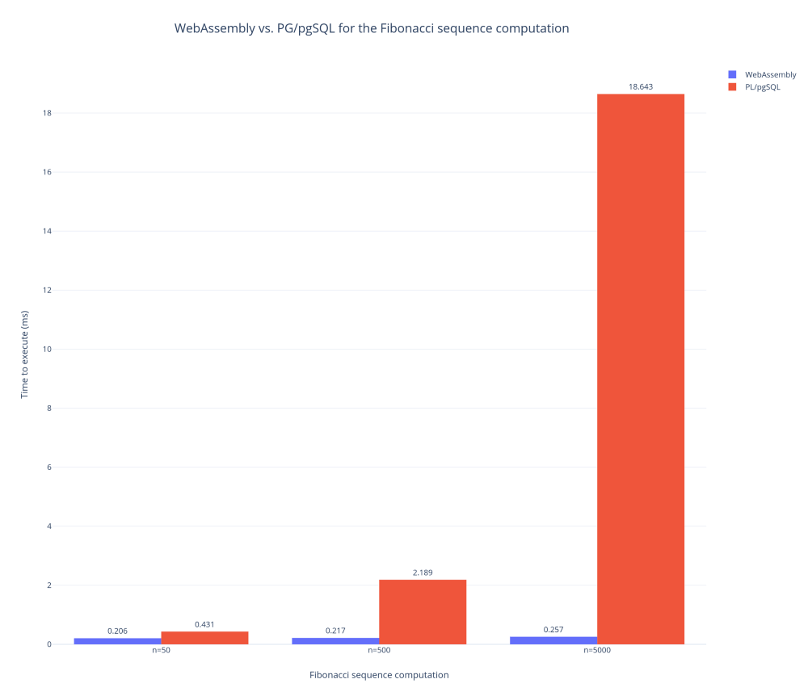

+++
title = "Announcing the first Postgres extension to run WebAssembly"
date = "2019-08-29"
description = "This article presents `wasmer-postgres`: the first Postgres extension to run WebAssembly. The article explores some possibilities. This is super experimental!"
[taxonomies]
keywords=["rust", "webassembly", "postgres", "runtime", "binding"]
[extra]
pinned = true
+++

*This is a copy of [an article I wrote for
Wasmer](https://medium.com/wasmer/announcing-the-first-postgres-extension-to-run-webassembly-561af2cfcb1).*

------------------------------------------------------------------------

WebAssembly is a portable binary format. That means the same program can
run anywhere.

> To uphold this bold statement, each language, platform and system must
> be able to run WebAssembly — as fast and safely as possible.

Let’s say it again. [Wasmer](https://github.com/wasmerio/wasmer) is a
WebAssembly runtime. We have successfully embedded the runtime in other
languages:

- In Rust, as it is written in Rust
- Using [C and C++
  bindings](https://github.com/wasmerio/wasmer/tree/master/lib/runtime-c-api)
- In PHP, using
  [`php-ext-wasm`](https://github.com/wasmerio/php-ext-wasm)
- In Python, using
  [`python-ext-wasm`](https://github.com/wasmerio/python-ext-wasm) —
  [wasmer package on PyPI](https://pypi.org/project/wasmer/)
- In Ruby, using
  [`ruby-ext-wasm`](https://github.com/wasmerio/ruby-ext-wasm) — [wasmer
  gem on RubyGems](https://rubygems.org/gems/wasmer)
- In Go, using [`go-ext-wasm`](https://github.com/wasmerio/go-ext-wasm)
  — see [the
  announcement](https://medium.com/wasmer/announcing-the-fastest-webassembly-runtime-for-go-wasmer-19832d77c050).

The community has also embedded Wasmer in awesome projects:

- .NET/C#, using
  [WasmerSharp](https://github.com/migueldeicaza/WasmerSharp)
- R, using [Wasmr](https://github.com/dirkschumacher/wasmr).

**It is now time to continue the story and to hang around…
[Postgres](https://www.postgresql.org/)!**

We are so happy to announce a newcrazy idea: **WebAssembly on
Postgres**. Yes, you read that correctly. On
[Postgres](https://github.com/wasmerio/postgres-ext-wasm).

## Calling a WebAssembly function from Postgres

As usual, we have to go through the installation process. There is no
package manager for Postgres, so it’s a manual step. The [Installation
Section of the
documentation](https://github.com/wasmerio/postgres-ext-wasm#installation)
explains the details; here is a summary:

```sh
$ # Build the shared library.
$ just build

$ # Install the extension in the Postgres tree.
$ just install

$ # Activate the extension.
$ echo 'CREATE EXTENSION wasm;' | \
      psql -h $host -d $database

$ # Initialize the extension.
$ echo "SELECT wasm_init('$(pwd)/target/release/libpg_ext_wasm.dylib');" | \
      psql -h $host -d $database
```

Once the extension is installed, activated and initialized, we can start
having fun!

The current API is rather small, however basic features are available.
The goal is to gather a community and to design a pragmatic API
together, discover the expectations, how developers would use this new
technology inside a database engine.

Let’s see how it works. To instantiate a WebAssembly module, we use the
`wasm_new_instance` function. It takes 2 arguments: The absolute path to
the WebAssembly module, and a prefix for the module exported functions.
Indeed, if a module exports a function named `sum`, then a Postgres
function named `prefix_sum` calling the `sum` function will be created
dynamically.

Let’s see it in action. Let’s start by editing a Rust program that
compiles to WebAssembly:

```rust
#[no_mangle]
pub extern fn sum(x: i32, y: i32) -> i32 {
    x + y
}
```

Once this file compiled to `simple.wasm`, we can instantiate the module,
and call the exported `sum` function:

```sql
-- New instance of the `simple.wasm` WebAssembly module.
SELECT wasm_new_instance('/absolute/path/to/simple.wasm', 'ns');

-- Call a WebAssembly exported function!
SELECT ns_sum(1, 2);

-- ns_sum
-- --------
-- 3
-- (1 row)
```

*Et voilà !* The `ns_sum` function calls the Rust `sum` function through
WebAssembly! How fun is that 😄?

## Inspect a WebAssembly instance

This section shows how to inspect a WebAssembly instance. At the same
time, it quickly explains how the extension works under the hood.

The extension provides two foreign data wrappers, gathered together in
the `wasm` foreign schema:

- `wasm.instances` is a table with the `id` and `wasm_file` columns,
  respectively for the unique instance ID, and the path of the
  WebAssembly module,
- `wasm.exported_functions` is a table with the `instance_id`,`name`,
  `inputs`, and `outputs` columns, respectively for the instance ID of
  the exported function, its name, its input types (already formatted
  for Postgres), and its output types (already formatted for Postgres).

Let’s see:

```sql
-- Select all WebAssembly instances.
SELECT * FROM wasm.instances;

-- id                                   |          wasm_file
-- -------------------------------------+-------------------------------
-- 426e17af-c32f-5027-ad73-239e5450dd91 | /absolute/path/to/simple.wasm
-- (1 row)

-- Select all exported functions for a specific instance.
SELECT
    name,
    inputs,
    outputs
FROM
    wasm.exported_functions
WHERE
    instance_id = '426e17af-c32f-5027-ad73-239e5450dd91';

-- name   |     inputs      | outputs
-- -------+-----------------+---------
-- ns_sum | integer,integer | integer
-- (1 row)
```

Based on these information, the `wasm` Postgres extension is able to
generate the SQL function to call the WebAssembly exported functions.

It sounds simplistic, and… to be honest, it is! The trick is to use
[foreign data
wrappers](https://www.postgresql.org/docs/current/fdwhandler.html),
which is an awesome feature of Postgres.

## How fast is it, or: Is it an interesting alternative to PL/pgSQL?

As we said, the extension API is rather small for now. The idea is to
explore, to experiment, to have fun with WebAssembly inside a database.
It is particularly interesting in two cases:

1.  To write extensions or procedures with any languages that compile to
    WebAssembly in place of
    [PL/pgSQL](https://www.postgresql.org/docs/10/plpgsql.html),
2.  To remove a potential performance bottleneck where speed is
    involved.

Thus we run a basic benchmark. Like most of the benchmarks out there, it
must be taken with a grain of salt.

> The goal is to compare the execution time between WebAssembly and
> PL/pgSQL, and see how both approaches scale.

The Postgres WebAssembly extension uses
[Wasmer](https://www.postgresql.org/docs/current/fdwhandler.html) as the
runtime, compiled with the Cranelift backend ([learn more about the
different
backends](https://medium.com/wasmer/a-webassembly-compiler-tale-9ef37aa3b537)).
We run the benchmark with Postgres 10, on a MacBook Pro 15" from 2016,
2.9Ghz Core i7 with 16Gb of memory.

The methodology is the following:

- Load both the `plpgsql_fibonacci` and the `wasm_fibonacci` functions,
- Run them with a query like
  `SELECT *_fibonacci(n) FROM generate_series(1, 1000)` where `n` has
  the following values: 50, 500, and 5000, so that we can observe how
  both approaches scale,
- Write the timings down,
- Run this methodology multiple times, and compute the median of the
  results.

Here come the results. The lower, the better.

<figure>

  

  <figcaption>

  Comparing WebAssembly vs. PL/pgSQL when computing the Fibonacci sequence
  with n=50, 500 and 5000.

  </figcaption>

</figure>

We notice that the Postgres WebAssembly extension is faster to run
numeric computations. The WebAssembly approach scales pretty well
compared to the PL/pgSQL approach, *in this situation*.

### When to use the WebAssembly extension?

So far, the extension only supports integers (on 32- and 64-bits). The
extension doesn’t support strings *yet*. It also doesn’t support
records, views or other Postgres types. Keep in mind this is the very
first step.

Hence, it is too soon to tell whether WebAssembly can be an alternative
to PL/pgSQL. But regarding the benchmark results above, we are sure they
can live side-by-side, WebAssembly has clearly a place in the ecosystem!
And we want to continue to pursue this exploration.

## Conclusion

We are already talking with people that are interested in using
WebAssembly inside databases. If you have any particular use cases,
please reach us at [wasmer.io](https://wasmer.io/), or on Twitter at
[@wasmerio](https://twitter.com/wasmerio) directly or me
[@mnt_io](https://twitter.com/mnt_io).

Everything is open source, as usual! Happy hacking.
