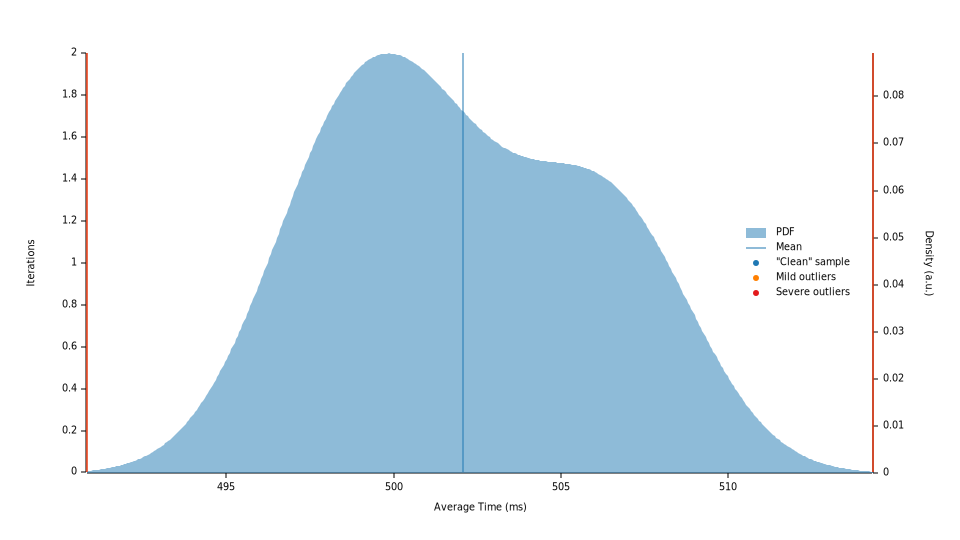
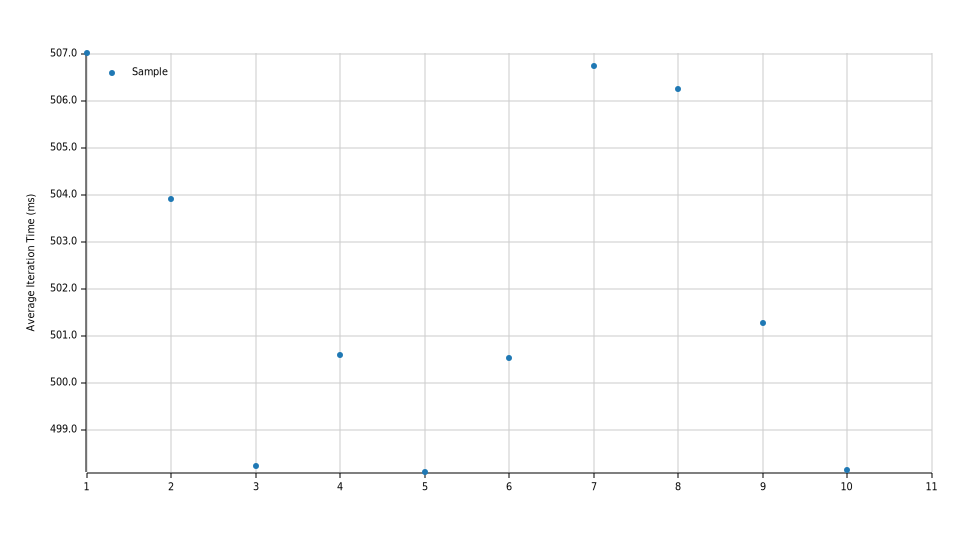
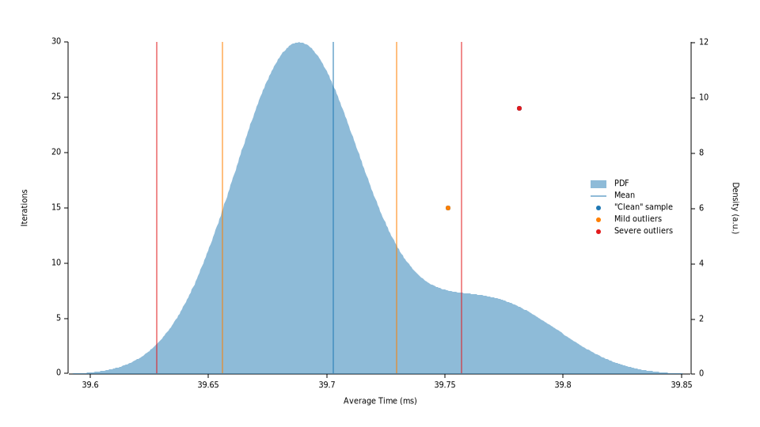
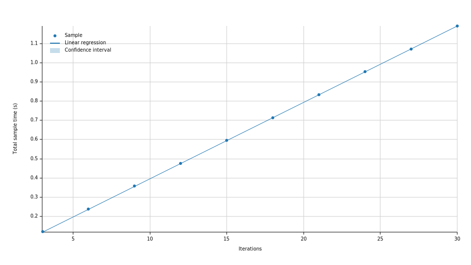
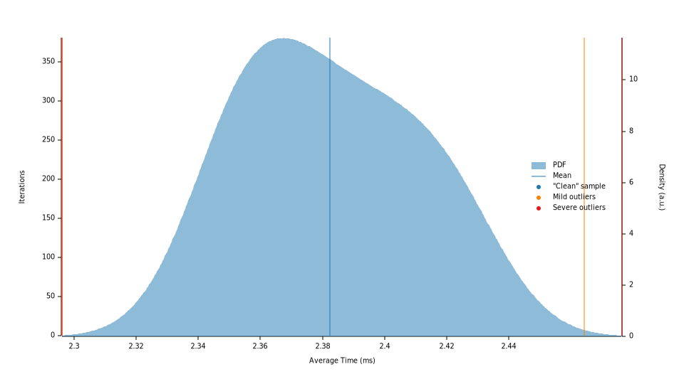
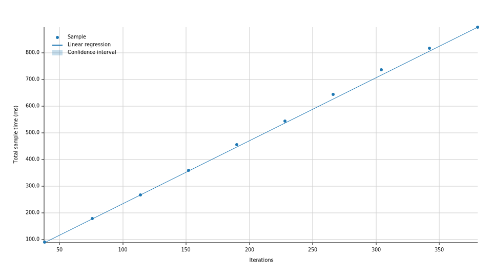

+++
title = "From 19k to 4.2M events/sec: story of a SQLite query optimisation"
date = "2025-09-12"
description = "After a user signaled a performance issue in a Matrix client, we have added new tracing timers in the Matrix Rust SDK to spot the problem. Once found, we have fixed an SQL query improving the throughput from 19k to 251k events/sec, and the speed from 502ms to 39ms. Then after another creative patch, the throughput has been improved to 4.2M events/sec, and the speed to 2ms."
[taxonomies]
keywords=["matrix", "messaging", "performance", "database", "sqlite", "rust"]
[extra]
pinned = true
+++

Sit down comfortably. Take a cushion if you wish. This is, <i>clear its
throat</i>, the story of a funny performance quest. The [Matrix Rust SDK] is a
set of crates aiming at providing all the necessary tooling to develop robust
and safe [Matrix] clients. Of course, it involves databases to persist some
data. The Matrix Rust SDK supports multiple databases: in-memory, [SQLite], and
[IndexedDB]. This story is about the SQLite database.

The structure we want to persist is a novel type we have designed specifically
for the Matrix Rust SDK: a [`LinkedChunk`]. It's the underlying structure that
holds all events manipulated by the Matrix Rust SDK. It is somewhat similar to
a [linked list]; the differences are subtle and the goal of this article is
_not_ to present all the details. We have developed many API around this type
to make all operations fast and efficient in the context of the Matrix protocol.
What we need to know is that in a `LinkedChunk<_, Item, Gap>`, each node
contains a `ChunkContent<Item, Gap>` defined as:

```rust
enum ChunkContent<Item, Gap> {
    Gap(Gap),
    Items(Vec<Item>),
}
```

Put it differently: each node can contain a _gap_, or a set of _items_ (be
Matrix events).



May I recapitulate?

Each Matrix _room_ contains a `LinkedChunk`, which is a set of _chunks_. Each
_chunk_ is either a _gap_ or a set of _events_. It seems to map fairly easily to
SQL tables, isn't it?



You're right: it's pretty straightforward! Let's see the first table:
`linked_chunks` which contains all the chunks. (Note that the schemas are
simplified for the sake of clarity).

```sql
CREATE TABLE "linked_chunks" (
    -- Which linked chunk does this chunk belong to?
    "linked_chunk_id" BLOB NOT NULL,

    -- Identifier of the chunk, unique per linked chunk.
    "id" INTEGER NOT NULL,

    -- Identifier of the previous chunk.
    "previous" INTEGER,

    -- Identifier of the next chunk.
    "next" INTEGER,

    -- Our enum for the content of the chunk: `E` for events, `G` for a gap.
    "type" TEXT CHECK("type" IN ('E', 'G')) NOT NULL,

    -- … other things …
);
```

Alrighty. Next contenders: the `event_chunks` and the `gap_chunks` tables, which
store the `ChunkContent`s of each chunk, respectively for `ChunkContent::Items`
and `ChunkContent::Gap`. In `event_chunks`, each row corresponds to an event. In
`gap_chunks`, each row corresponds to a gap.

```sql
CREATE TABLE "event_chunks" (
    -- Which linked chunk does this event belong to?
    "linked_chunk_id" BLOB NOT NULL,

    -- Which chunk does this event refer to?
    "chunk_id" INTEGER NOT NULL,

    -- The event ID.
    "event_id" BLOB NOT NULL,

    -- Position (index) in the **chunk**.
    "position" INTEGER NOT NULL,

    -- … other things …
);

CREATE TABLE "gap_chunks" (
    -- Which linked chunk does this event belong to?
    "linked_chunk_id" BLOB NOT NULL,

    -- Which chunk does this gap refer to?
    "chunk_id" INTEGER NOT NULL,

    -- … other things …
);
```

Last contender, `events`. The assiduous reader may have noted that
`event_chunks` doesn't contain the content of the events: only its ID and its
position, <i>roll its eyes</i>… let's digress a bit, should we? Why that? To
handle out-of-band events. In the Matrix protocol, we can receive events via:

- [the `/sync` endpoint][`/sync`], it's the main source of inputs, we get most
  of the events via this API,
- [the `/messages` endpoint][`/messages`], when we need to get events around
  a particular events; this is helpful if we need to paginate backwards or
  forwards around an event,
- [the `/context` endpoint][`/context`], if we need to get more context about
  an event.
- but there is more, like [pinned events][`m.room.pinned_events`], and so on.

When an event is fetched but cannot be positioned regarding other events, it is
considered _out-of-band_: it belongs to zero linked chunk, but we keep it in the
database. Maybe we can attach it to a linked chunk later, or we want to keep it
for saving future network requests. Anyway. You're a great digression companion.
Let's jump back on our tables.

The `events` table contains _all_ the events: in-band _and_ out-of-band.

```sql
-- Events and their content.
CREATE TABLE "events" (
    -- The ID of the event.
    "event_id" BLOB NOT NULL,

    -- The JSON encoded content of the event (it's an encrypted value).
    "content" BLOB NOT NULL,

    -- … other things …
);
```

At some point, we need to fetch metadata about a `LinkedChunk`. A certain
algorithm needs these metadata to work efficiently. We don't need to load all
events, however we need:

- to know all the chunks that are part of a linked chunk,
- for each chunk, the number of events: 0 in case of a `ChunkContent::Gap`
  (`G`), or the number of events in case of a `ChunkContent::Items` (`E`).

A first implementation has landed in the Matrix Rust SDK. All good. When
suddenly…

## <q cite="https://github.com/element-hq/element-x-ios-rageshakes/issues/4248">Incredibly slow sync</q>

A power-user[^power-user] was [experiencing slowness][rageshake]. It's always
a delicate situation. How to know the reason of the slowness? Is it the device?
The network? The asynchronous runtime? A lock contention? The file system? …
The database?

We don't have the device within easy reach. Hopefully, Matrix users are always
nice and willing to help! We have added a bunch of logs, then the user has
reproduced the problem, and shared its logs (via a rageshake) with us. Logs are
never trivial to analyse. However, here is a tip we use in the Matrix Rust SDK:
we have a special tracing type that logs the time spent in a portion of the
code; called [`TracingTimer`].

Basically, when a `TracingTimer` is created, it keeps its creation time in
memory. And when the `TracingTimer` is dropped, it emits a log containing the
elapsed time since its creation. It looks like this (it uses [the `tracing` library][`tracing`]):

```rust
pub struct TracingTimer {
    id: String,
    callsite: &'static DefaultCallsite,
    start: Instant,
    level: tracing::Level,
}

impl Drop for TracingTimer {
    fn drop(&mut self) {
        let enabled = tracing::level_enabled!(self.level) && {
            let interest = self.callsite.interest();

            !interest.is_never()
                && tracing::__macro_support::__is_enabled(self.callsite.metadata(), interest)
        };

        if !enabled {
            return;
        }

        let message = format!("_{}_ finished in {:?}", self.id, self.start.elapsed());

        let metadata = self.callsite.metadata();
        let fields = metadata.fields();
        let message_field = fields.field("message").unwrap();
        let values = [(&message_field, Some(&message as &dyn tracing::Value))];

        // This function is hidden from docs, but we have to use it
        // because there is no other way of obtaining a `ValueSet`.
        // It's not entirely clear why it is private. See this issue:
        // https://github.com/tokio-rs/tracing/issues/2363
        let values = fields.value_set(&values);

        tracing::Event::dispatch(metadata, &values);
    }
}
```

And with that, let's use its companion macro [`timer!`] (I won't copy-paste it
here, it's pretty straightforward):

```rust
{
    let _timer = timer!("built something important");

    // … build something important …

    // `_timer` is dropped here, and will emit a log.
}
```

With this technique, we were able to inspect the logs and saw immediately what
was slow… assuming we have added `timer!`s at the right places! It's not magic,
it doesn't find performance issues for you. You have to probe the correct places
in your code, and refine if necessary.



I don't know if you heard about _sampling profilers_, but those are programs
far superior at analysing performance problems, compared to your… rustic
`TracingTimer` (pun intended!). Such programs can provide flamegraphs, call
trees etc.

I'm personally a regular user of [samply], a command line CPU profiler relying
on the [Firefox profiler] for its UI. It works on macOS, Linux and Windows.

[samply]: https://github.com/mstange/samply
[Firefox profiler]: https://github.com/firefox-devtools/profiler



I do also use `samply` pretty often! But you need an access to the processus
to use such tools. Here, the Matrix Rust SDK is used and embedded inside Matrix
clients. We have no access to it. It lives on devices everywhere around the
world. We may use better log analysers to infer “call trees”, but supporting
asynchronous logs (because the code is asynchronous) makes it very difficult.
And I honestly don't know if such a thing exists.

So. Yes. [We found the culprit][pr-5407]. With [`ripgrep`], we were able to scan
megabytes of logs and find the culprit pretty quickly. I was looking for lags of
the order of a second. I wasn't disappointed:

```shell
$ rg '_method_ finished in.*> load_all_chunks_metadata' all.log | rg '\d+(\.\d+)?s' --only-matching | sort --numeric-sort --reverse
107.121747125s
79.909931458s
10.348993583s
8.827636417s
8.614481625s
8.009787875s
5.99637875s
4.118492334s
3.910040333s
3.718858334s
3.689340667s
3.661383208s
```

107 seconds. Be 1 minute and 47 seconds. Hello sweety.

## The slow query

`load_all_chunks_metadata` is a method that runs this SQL query:

```sql
SELECT
    lc.id,
    lc.previous,
    lc.next,
    COUNT(ec.event_id) as number_of_events
FROM linked_chunks as lc
LEFT JOIN event_chunks as ec
ON ec.chunk_id = lc.id
WHERE lc.linked_chunk_id = ?
GROUP BY lc.id
```

For each chunk of the linked chunk, it counts the number of events associated to
this chunk. That's it.

Do you remember that a chunk can be of two kinds: `ChunkContent::Items` if it
contains a set of events, or `ChunkContent::Gap` if it contains a gap, so, no
event.

This query does the following:

1. if the chunk is of kind `ChunkContent::Items`, it does count all events
   associated to itself (via `ec.chunk_id = lc.id`),
2. otherwise, the chunk is of kind `ChunkContent::Gap`, so it will try to count
   but… no event is associated to it: it's impossible to get `ec.chunk_id =
   lc.id` to be true for a gap. This query will scan _all events_ for each
   gap… for nothing! This is a linear scan here. If there are 300 gaps for this
   linked chunk, and 5000 events, 1.5 millions events will be scanned for **no
   reason**!

How lovingly inefficient.

## <math><mn>12.6</mn><mo>×</mo></math> faster

<q>Let's use an [`INDEX`][`CREATE INDEX`]</q> I hear you say (let's pretend
you're saying that, please, for the sake of the narrative!).

A database index provides rapid lookups after all. It has become a reflex
amongst the developer community.



Indexes are designed to quickly locate data without scanning the full table. An
index contains a copy of the data, organised in a way enabling very efficient
search. Behind the scene, it uses various data structures, involving trade-offs
between lookup performance and index size. Most of the time, an index makes it
possible to transform a linear lookup,
<math>
  <mi>O</mi><mo>(</mo>
    <mi>n</mi>
  <mo>)</mo>
</math>,
to a logarithmic lookup,
<math>
  <mi>O</mi><mo>(</mo>
    <mo lspace="0" rspace="0">log</mo><mo>(</mo>
      <mi>n</mi>
    <mo>)</mo>
  <mo>)</mo>
</math>.
See [Database index] to learn more.

[Database index]: https://en.wikipedia.org/wiki/Database_index



That's correct. But we didn't want to use an index here. The reason is twofold:

1. **More spaces**. Remember that _Le Procureur_ said an index contains a _copy_
   of the data. Here, the data is [the event ID][event ID]. It's not heavy, but
   it's not nothing. Moreover, we are not counting the _key_ to associate the
   _copied data_ to the row containing the real data in the source table.
2. **Still extra useless time**. We would still need to traverse the index
   for gaps, which is pointless. [SQLite implements indexes as
   B-Trees][sqlite-btree], which is really efficient, but still, we already know
   that a gap has zero event because… it's… a gap between events!

Do you remember that the `linked_chunks` table has a `type` column? It contains
`E` when the chunk is of kind `ChunkContent::Items` —it represents a set of
events—, and `G` when of kind `ChunkContent::Gap` —it represents a gap—. Maybe… <i>stare into the void</i>



May I interrupt?

Do you know that SQLite provides [a `CASE` expression][`CASE`]? I know it's
unusual. SQL designers prefer to think in terms of sets, sub-sets, joins,
temporal tables, partial indexes… but honestly, for what I'm concerned, in
our case, it's simple enough and it can be powerful. It's a maddeningly
pragmatic `match` statement.

Moreover, the `type` column is already typed as an enum with the `CHECK("type"
IN ('E', 'G'))` constraint. Maybe the SQL engine can run some even smarter
optimisations for us.

[`CASE`]: https://sqlite.org/lang_expr.html#the_case_expression



Oh, that would be brilliant! If `type` is `E`, we count the number of events,
otherwise we conclude it's _de facto_ zero, isn't it? Let's try. The SQL query
then becomes:

```sql
SELECT
    lc.id,
    lc.previous,
    lc.next,
    CASE lc.type
    WHEN 'E' THEN (
        SELECT COUNT(ec.event_id)
        FROM event_chunks as ec
        WHERE ec.chunk_id = lc.id
    )
    ELSE
        0
    END
    as number_of_events
FROM linked_chunks as lc
WHERE lc.linked_chunk_id = ?
```

Since we have spotted the problem, we have written a benchmark to measure the
solutions. The benchmark simulates 10'000 events, with 1 gap every 80 events.
A set of data we consider _realistic_ somehow for a normal user (not for a
power-user though, because a power-user has usually more gaps than events). Here
are the before/after results.

<figure>

  <table>
    <thead>
      <tr>
        <th></th>
        <th title="0.95 confidence level">Lower bound</th>
        <th>Estimate</th>
        <th title="0.95 confidence level">Upper bound</th>
      </tr>
    </thead>
    <tbody>
      <tr>
        <td>Throughput</td>
        <td>19.832 Kelem/s</td>
        <td>19.917 Kelem/s</td>
        <td>19.999 Kelem/s</td>
      </tr>
      <tr>
        <td><math><msup><mi>R</mi><mn>2</mn></msup></math></td>
        <td>0.0880234</td>
        <td>0.1157540</td>
        <td>0.0857823</td>
      </tr>
      <tr>
        <td>Mean</td>
        <td>500.03 ms</td>
        <td>502.08 ms</td>
        <td>504.24 ms</td>
      </tr>
      <tr>
        <td title="Standard Deviation">Std. Dev.</td>
        <td>2.2740 ms</td>
        <td>3.6256 ms</td>
        <td>4.1963 ms</td>
      </tr>
      <tr>
        <td>Median</td>
        <td>498.23 ms</td>
        <td>500.93 ms</td>
        <td>506.25 ms</td>
      </tr>
      <tr>
        <td title="Median Absolute Deviation">MAD</td>
        <td>129.84 µs</td>
        <td>4.1713 ms</td>
        <td>6.1184 ms</td>
      </tr>
    </tbody>
  </table>

  <figcaption>

  Benchmark's results for the original query with `COUNT` and `LEFT JOIN`.

  </figcaption>
</figure>

<details>
  <summary>

  The Probability Distribution Function graph, and the Iteration times graph for
  the `LEFT JOIN` approach

  </summary>

  <figure>

  [](./1-pdf.svg)

  <figcaption>

  Benchmark's Probability Distribution Function for the `LEFT JOIN` approach.

  </figcaption>

  </figure>

  <figure>

  [](./1-iteration-times.svg)

  <figcaption>

  Benchmark's Iteration Times for the `LEFT JOIN` approach.

  </figcaption>

  </figure>
</details>

<figure>

  <table>
    <thead>
      <tr>
        <th></th>
        <th title="0.95 confidence level">Lower bound</th>
        <th>Estimate</th>
        <th title="0.95 confidence level">Upper bound</th>
      </tr>
    </thead>
    <tbody>
      <tr>
        <td>Throughput</td>
        <td>251.61 Kelem/s</td>
        <td>251.84 Kelem/s</td>
        <td>251.98 Kelem/s</td>
      </tr>
      <tr>
        <td><math><msup><mi>R</mi><mn>2</mn></msup></math></td>
        <td>0.9999778</td>
        <td>0.9999833</td>
        <td>0.9999673</td>
      </tr>
      <tr>
        <td>Mean</td>
        <td>39.684 ms</td>
        <td>39.703 ms</td>
        <td>39.726 ms</td>
      </tr>
      <tr>
        <td title="Standard Deviation">Std. Dev.</td>
        <td>8.8237 µs</td>
        <td>35.948 µs</td>
        <td>47.987 µs</td>
      </tr>
      <tr>
        <td>Median</td>
        <td>39.683 ms</td>
        <td>39.691 ms</td>
        <td>39.725 ms</td>
      </tr>
      <tr>
        <td title="Median Absolute Deviation">MAD</td>
        <td>1.9369 µs</td>
        <td>13.000 µs</td>
        <td>50.566 µs</td>
      </tr>
    </tbody>
  </table>

  <figcaption>

  Benchmark's results for the new query with the `CASE` expression.

  </figcaption>
</figure>

<details>
  <summary>

  The Probability Distribution Function graph, and the Linear Regression graph
  for the `CASE` approach

  </summary>

  <figure>

  [](./2-pdf.svg)

  <figcaption>

  Benchmark's Probability Distribution Function for the `CASE` approach.

  </figcaption>

  </figure>

  <figure>

  [](./2-linear-regression.svg)

  <figcaption>

  Benchmark's Linear Regression for the `CASE` approach.

  </figcaption>

  </figure>
</details>

The throughput and the time are <math><mn>12.6</mn><mo>×</mo></math> better. No
`INDEX`. No more `LEFT JOIN`. Just a simple `CASE` expression. [You can see the patches containing the benchmark and the fix][pr-5411].

But that's not all…

## <math><mn>211</mn><mo>×</mo></math> faster

It's clearly better, but we couldn't stop ourselves. Having spotted the problem,
and having found this solution, it has made us creative! We have noticed that
we are running one query per chunk of kind `ChunkContent::Items`. If the linked
chunk contains 100 chunks, it will run 101 queries.

Then suddenly, <i>hit forehead with the hand's palm</i>, an idea pops! What if
we could only use 2 queries for all scenarios!

1. The first query would count all events for each chunk in `events_chunk` in
   one pass, and would store that in a `HashMap`,
2. The second query would fetch all chunks also in one pass,
3. Finally, Rust will fill the number of events for each chunk based on the data
   in the `HashMap`.

The first query translates like so in Rust:

```rust
// The first query.
let number_of_events_by_chunk_ids = transaction
    .prepare(
        r#"
        SELECT
            ec.chunk_id,
            COUNT(ec.event_id)
        FROM event_chunks as ec
        WHERE ec.linked_chunk_id = ?
        GROUP BY ec.chunk_id
        "#,
    )?
    .query_map((&hashed_linked_chunk_id,), |row| {
        Ok((
            row.get::<_, u64>(0)?,
            row.get::<_, usize>(1)?
        ))
    })?
    .collect::<Result<HashMap<_, _>, _>>()?;
```

And the second query translates like so[^simplified-code]:

```rust
transaction
    .prepare(
        r#"
        SELECT
            lc.id,
            lc.previous,
            lc.next,
            lc.type
        FROM linked_chunks as lc
        WHERE lc.linked_chunk_id = ?
        "#,
    )?
    .query_map((&hashed_linked_chunk_id,), |row| {
        Ok((
            row.get::<_, u64>(0)?,
            row.get::<_, Option<u64>>(1)?,
            row.get::<_, Option<u64>>(2)?,
            row.get::<_, String>(3)?,
        ))
    })?
    .map(|metadata| -> Result<_> {
        let (identifier, previous, next, chunk_type) = metadata?;

        // Let's use the `HashMap` from the first query here!
        let number_of_events = number_of_events_by_chunk_ids.get(&id).copied().unwrap_or(0);

        Ok(ChunkMetadata {
            identifier,
            previous,
            next,
            number_of_events,
        })
    })
    .collect::<Result<Vec<_>, _>>()
```

Only two queries. All tests are passing. Now let's see what the benchmark has to say!

<figure>

  <table>
    <thead>
      <tr>
        <th></th>
        <th title="0.95 confidence level">Lower bound</th>
        <th>Estimate</th>
        <th title="0.95 confidence level">Upper bound</th>
      </tr>
    </thead>
    <tbody>
      <tr>
        <td>Throughput</td>
        <td>4.1490 Melem/s</td>
        <td>4.1860 Melem/s</td>
        <td>4.2221 Melem/s</td>
      </tr>
      <tr>
        <td><math><msup><mi>R</mi><mn>2</mn></msup></math></td>
        <td>0.9961591</td>
        <td>0.9976310</td>
        <td>0.9960356</td>
      </tr>
      <tr>
        <td>Mean</td>
        <td>2.3670 ms</td>
        <td>2.3824 ms</td>
        <td>2.3984 ms</td>
      </tr>
      <tr>
        <td title="Standard Deviation">Std. Dev.</td>
        <td>16.065 µs</td>
        <td>26.872 µs</td>
        <td>31.871 µs</td>
      </tr>
      <tr>
        <td>Median</td>
        <td>2.3556 ms</td>
        <td>2.3801 ms</td>
        <td>2.4047 ms</td>
      </tr>
      <tr>
        <td title="Median Absolute Deviation">MAD</td>
        <td>3.8003 µs</td>
        <td>36.438 µs</td>
        <td>46.445 µs</td>
      </tr>
    </tbody>
  </table>

  <figcaption>

  Benchmark's results for the two queries approach.

  </figcaption>
</figure>

<details>
  <summary>

  The Probability Distribution Function graph, and the Linear Regression graph
  for the two queries approach

  </summary>

  <figure>

  [](./3-pdf.svg)

  <figcaption>

  Benchmark's Probability Distribution Function for the two queries approach.

  </figcaption>

  </figure>

  <figure>

  [](./3-linear-regression.svg)

  <figcaption>

  Benchmark's Linear Regression for the two queries approach.

  </figcaption>

  </figure>
</details>

**It is <math><mn>16.7</mn><mo>×</mo></math> faster compared to the previous
solution, be <math><mn>211</mn><mo>×</mo></math> faster than the first query!
We went from 502ms to 2ms. That's mental! From a throughput of 19.9 Kelem/s
to 4.2 Melem/s!** [You can see the patches containing the improvement][pr-5425].

The throughput is measured by _element_, where an _element_ here represents
a Matrix event. Consequently, 4 Melem/s means 4 millions events per second,
which means that `load_all_chunks_metadata` can do its computation at a rate of
4 millions events per second.

I think we can stop here. Performance are finally acceptable.

## Lessons

- [Write benchmarks (with Criterion)][criterion].
- Run benchmarks.
- Be aware of [the SQL query planner][sqlite-query-planner].
- Be careful with joins.
- Know your data.
- Take a step back and count.
- SQLite is fast.

Notice how the SQL tables layout didn't change. Notice how the `LinkedChunk`
implementation didn't change. Only the SQL queries have changed, and it has
dramatically improved the situation.

This is joint effort between [Benjamin Bouvier][ben], [Damir Jelić][damir] and I.


[Matrix Rust SDK]: https://github.com/matrix-org/matrix-rust-sdk
[Matrix]: https://matrix.org/
[SQLite]: https://sqlite.org/
[IndexedDB]: https://developer.mozilla.org/en-US/docs/Web/API/IndexedDB_API
[`LinkedChunk`]: https://docs.rs/matrix-sdk-common/0.14.0/matrix_sdk_common/linked_chunk/index.html
[linked list]: https://en.wikipedia.org/wiki/Linked_List
[`/sync`]: https://spec.matrix.org/v1.15/client-server-api/#get_matrixclientv3sync
[`/messages`]: https://spec.matrix.org/v1.15/client-server-api/#get_matrixclientv3roomsroomidmessages
[`/context`]: https://spec.matrix.org/v1.15/client-server-api/#get_matrixclientv3roomsroomidcontexteventid
[`m.room.pinned_events`]: https://spec.matrix.org/v1.15/client-server-api/#mroompinned_events
[`TracingTimer`]: https://docs.rs/matrix-sdk-common/0.14.0/matrix_sdk_common/tracing_timer/struct.TracingTimer.html
[`tracing`]: https://docs.rs/tracing/
[`timer!`]: https://docs.rs/matrix-sdk-common/0.14.0/matrix_sdk_common/macro.timer.html
[pr-5407]: https://github.com/matrix-org/matrix-rust-sdk/pull/5407
[rageshake]: https://github.com/element-hq/element-x-ios-rageshakes/issues/4248
[`ripgrep`]: https://github.com/BurntSushi/ripgrep
[`CREATE INDEX`]: https://sqlite.org/lang_createindex.html
[event ID]: https://spec.matrix.org/v1.15/appendices/#event-ids
[pr-5411]: https://github.com/matrix-org/matrix-rust-sdk/pull/5411
[pr-5425]: https://github.com/matrix-org/matrix-rust-sdk/pull/5425
[sqlite-btree]: https://sqlite.org/arch.html
[criterion]: https://bheisler.github.io/criterion.rs/book/index.html
[sqlite-query-planner]: https://sqlite.org/queryplanner-ng.html
[ben]: https://github.com/bnjbvr
[damir]: https://github.com/poljar


[^power-user]: We consider a _power-user_ a user with more than 2000 rooms. I
    hear your laugth! But guess what? We have users with more than 4000 rooms.
    And I'm excluding bots here. The Matrix Rust SDK can be used to develop
    bots, which can sit in thousands and thousands rooms easily. That said: we
    have to be performant.
[^simplified-code]: The code has been simplified a little bit. In reality, basic
    Rust types, like `u64` or `Option<u64>`, are mapped to linked chunk's types.
