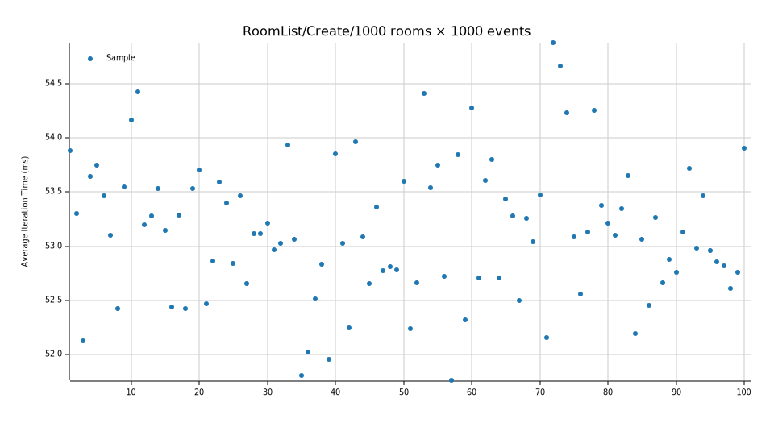

+++
title = "About memory pressure, lock contention, and data-oriented design"
date = "2026-02-12"
description = ""
[taxonomies]
keywords=["rust", "performance", "lock", "memory", "data-oriented design"]
[extra]
pinned = true
+++

I'm here to narrate you a story about performance. Recently, I was in the same
room than a Memory Pressure and a Lock Contention. It took me a while to recognize
them. The legend says it only happens in obscure, low-level systems, but I'm
here to refute the legend. While exploring, I had the pleasure to fix a funny
bug in a higher-order stream: lucky us, to top it all off, we even have a sweet
treat! I believe we have all the ingredients for a juicy story. Let's cook, and
<em lang="fr">bon appétit !</em>

## On a Beautiful Morning…

Switching on my [Dygma Defy][defy], unlocking my computer, reading the news from
my colleagues, when suddenly I come across this message:

> Does anyone also experience a frozen room list?

Ah yeah, since some years now, I'm employed by [Element] to work on the [Matrix
Rust SDK]. If one needs to write a complete, modern, cross-platform, fast Matrix
client or bot, this SDK is an excellent choice. The SDK is composed of many
crates. Some are very low in the stack and are not aimed to be used directly by
the developers, like `matrix_sdk_crypto`. Some others are higher in the stack,
where the highest is for User Interfaces (UI) with `matrix_sdk_ui`. Despite
being a bit opinionated, they are designed to provide high-quality features
everybody expects in a modern Matrix client.

One of them is the Room List. The Room List is the place where most of users
spent their time in a messaging application (along with the Timeline, i.e. the
room's messages). Some expectations from this component:

- Be superfast,
- List all the rooms,
- Interact with rooms (open them, mark them as unread etc.),
- Filter the rooms,
- Sort the rooms.

Let's focus on the part that interests us today: _Sort the rooms_. The Room List
holds… no room. It actually provides a _stream of updates about rooms_; more
precisely a `Stream<Item = Vec<VectorDiff<Room>>>`. What does it mean? This
stream yields a vector of “diffs” of rooms. I'm writing [a series about reactive
programming](@/series/reactive-programming-in-rust/_index.md), you might be
interested to read more about it. Otherwise, here is what you need to know.

[The `VectorDiff` type][`VectorDiff`] comes from [the `eyeball-im`
crate][`eyeball_im`], initially created for the Matrix Rust SDK as a solid
foundation for reactive programming. It looks like this:

```rust
pub enum VectorDiff<T> {
    Append {
        values: Vector<T>,
    },
    Clear,
    PushFront {
        value: T,
    },
    PushBack {
        value: T,
    },
    PopFront,
    PopBack,
    Insert {
        index: usize,
        value: T,
    },
    Set {
        index: usize,
        value: T,
    },
    Remove {
        index: usize,
    },
    Truncate {
        length: usize,
    },
    Reset {
        values: Vector<T>,
    },
}
```

It represents a _change_ in [an `ObservableVector`][`ObservableVector`].
This is like a `Vec`, but [one can subscribe to the
changes][`ObservableVector::subscribe`], and will receive… well… `VectorDiff`s!

The Room List type merges several streams into a single stream representing
the list of rooms. For example, let's imagine the room at index 3 receives a
new message. Its “preview” (the _latest event_ displayed beneath the room's
name, you know, <q>Alice: Hello!</q>) has changed. Moreover, the Room List is
also sorting rooms by their “recency” (the _time_ of the room). And since the
“preview” has changed, its “recency” changes too, which means the room is sorted
and re-positioned. Then, we expect the Room List's stream to yield:

1. `VectorDiff::Set { index: 3, value: new_room }` because of the new “preview”,
2. `VectorDiff::Remove { index: 3 }` to remove the room… immediately followed by
3. `VectorDiff::PushFront { value: new_room }` to insert the room at the top of the Room List.

This reactive programming mechanism has proven to be extremely efficient.



I did my calculation: the size of `VectorDiff<Room>` is 72 bytes (mostly
because `Room` contains [an `Arc`][`Arc`] over the real struct type). This is
pretty small for an update. Not only it brings a small memory footprint, but it
crosses the FFI boundary pretty easily, making it easy to map to other languages
like Swift or Kotlin. Languages that provide UI components, like [SwiftUI] or
[Jetpack Compose].

[`Arc`]: https://doc.rust-lang.org/std/sync/struct.Arc.html
[SwiftUI]: https://developer.apple.com/swiftui/
[Jetpack Compose]: https://developer.android.com/compose



Absolutely! Two popular UI components where a `VectorDiff` maps
straightforwardly to their List component update operations. They are actually
remarkably pretty close[^vectordiff_on_other_uis].

You're always a good digression companion, thank you. Let's go back on our
problem:

> What frozen means here?

The Room List is simply… _blank_, _empty_, <em lang="fr">vide</em>, <em
lang="es">vacía</em>, <em lang="it">vuoto</em>, <em lang="ar">خلو</em>… well,
you get the idea.

> What could freeze the Room List?

What are our options?



It would be a real pleasure if you let me assist you in this task.

- The network sync is not running properly, hence giving the _impression_ of a
  frozen Room List? Hmm, no, everything works as expected here. Moreover, local
  data should be displayed.
- The “source streams” used by the Room List are not yielding the expected
  updates? No, everything works like a charm.
- The “merge of streams” is broken for some reasons? No, still not.
- The filtering of the streams? Not touched since a long time.
- The sorting? Ah, maybe, I reckon we have changed something here…



Indeed, we have changed one sorter recently. Let's take a look at how this Room List stream is computed, shall we?

```rust
let stream = stream! {
    loop {
        // Wait for the filter to be updated.
        let filter = filter_cell.take().await;

        // Get the “raw” entries.
        let (values, stream) = self.entries();

        // Combine normal stream updates with other room updates.
        let stream = merge_streams(values.clone(), stream, other_updates);

        let (values, stream) = (values, stream)
            .filter(filter)
            .sort_by(new_sorter_lexicographic(vec![
                // Sort by latest event's kind.
                Box::new(new_sorter_latest_event()),
                // Sort rooms by their recency.
                Box::new(new_sorter_recency()),
                // Finally, sort by name.
                Box::new(new_sorter_name()),
            ]))
            .dynamic_head_with_initial_value(page_size, limit_stream);

        // Clearing the stream before chaining with the real stream.
        yield once(ready(vec![VectorDiff::Reset { values }]))
            .chain(stream);
    }
}
.switch();
```

There is a lot going on here. Sadly, we are not going to explain everything in
this beautiful piece of art[^switch].

The `.filter()`, `.sort_by()`, `.dynamic_head_with_initial_value()` methods
are part of [the `eyeball-im-util` crate][`eyeball_im_util`]. They are used
to filter, sort etc. a stream: They are essentially mapping a `Stream<Item
= Vec<VectorDiff<T>>>` to another `Stream<Item = Vec<VectorDiff<T>>>`. In
other terms, they “change” the `VectorDiff`s on-the-fly to simulate filtering,
sorting, or something else. Let's see a very concrete example with [the `Sort`
higher-order stream][`eyeball_im_util::vector::Sort`] (the following example
is mostly a copy of the documentation of `Sort`, but [since I wrote this
algorithm, I guess you, dear reader, will find it acceptable][eyeball#43]).

How about a vector of `char`? We want a `Stream` of _changes_ about this vector
(the famous `VectorDiff`). We also want to _simulate_ a sorted vector, by only
modifying the _changes_. It looks like so:

```rust
use std::cmp::Ordering;

use eyeball_im::{ObservableVector, VectorDiff};
use eyeball_im_util::vector::VectorObserverExt;
use stream_assert::{assert_next_eq, assert_pending};

// Our comparison function.
fn cmp<T>(left: &T, right: &T) -> Ordering
where
    T: Ord,
{
    left.cmp(right)
}

// Our vector.
let mut vector = ObservableVector::<char>::new();
let (initial_values, mut stream) = vector.subscribe().sort_by(cmp);
//                                                            ^^^
//                                                            |
//                                                            there

assert!(initial_values.is_empty());
assert_pending!(stream);
```

Alrighty. That's a good start. `vector` is empty, so the initial values from the
subscribe are empty, and the `stream` is also pending[^stream_assert]. Time to
play with this new toy, isn't it?

```rust
// Append unsorted values.
vector.append(vector!['d', 'b', 'e']);

// We get a `VectorDiff::Append` with sorted values!
assert_next_eq!(
    stream,
    VectorDiff::Append { values: vector!['b', 'd', 'e'] }
);
assert_pending!(stream);

// Let's recap what we have. `vector` is our `ObservableVector`,
// `stream` is the “sorted view”/“sorted stream” of `vector`:
//
// | index    | 0 1 2 |
// | `vector` | d b e |
// | `stream` | b d e |
```

So far, so good. It looks naive and simple: one operation in, one operation out.
It's funnier when things get more complicated though:

```rust
// Append multiple other values.
vector.append(vector!['f', 'g', 'a', 'c']);

// We get three `VectorDiff`s this time!
assert_next_eq!(
    stream,
    VectorDiff::PushFront { value: 'a' }
);
assert_next_eq!(
    stream,
    VectorDiff::Insert { index: 2, value: 'c' }
);
assert_next_eq!(
    stream,
    VectorDiff::Append { values: vector!['f', 'g'] }
);
assert_pending!(stream);

// Let's recap what we have:
//
// | index    | 0 1 2 3 4 5 6 |
// | `vector` | d b e f g a c |
// | `stream` | a b c d e f g |
//              ^   ^     ^^^
//              |   |     |
//              |   |     with `VectorDiff::Append { .. }`
//              |   with `VectorDiff::Insert { index: 2, .. }`
//              with `VectorDiff::PushFront { .. }`
```

Notice how `vector` is _never_ sorted. That's the power of these higher-order
streams of `VectorDiff`s: light and —more importantly— **combinable**! I repeat
myself: we are always mapping a `Stream<Item = Vec<VectorDiff<T>>>` to another
`Stream<Item = Vec<VectorDiff<T>>>`. That's the same type! The whole collection
is never computed entirely, except for the initial values: only the changes are
handled and trigger a computation. Knowing that, in the manner of [`Future`],
`Stream` is lazy —i.e. it does something only when polled—, it makes things
pretty efficient. And…



… as your favourite digression companion, I really, deeply, appreciate these
details. Nonetheless, I hope you dont't mind if… I suggest to you that… you
might want to, maybe, go back to… <small>the main… subject, don't you think?</small>



Which topic? Ah! The frozen Room List! Sorters are _not_ the culprit. There.
Happy? Short enough?

These details were important. Kind of. I hope you've learned something along
the lines. Next, let's see how a sorter works, and how it is responsible for our
memory pressure and lock contention.

### Randomness

Taking a step back, I was asking myself: <q>Is it really frozen?</q>. Cherry
on the cake: I was unable to reproduce the problem! Even the reporters of
the problem were unable to reproduce it consistently. Hmm, a random problem?
Fortunately, two of the reporters are obstinate. Ultimately, we got analysis.



Memory analysis of Element X in Android Studio (Element X is based on the Matrix
Rust SDK). It presents a callback tree, with the number of allocations and
deallocations for each node in this tree.

And, holy cow, we see **a lot** of memory allocations, exactly 322'042 to be
precise, counting for 743Mib, for the `eyeball_im_util::vector::sort::SortBy`
type!



The Room List wasn't frozen. It was taking **a lot** of time to yield values.
Sometimes, up to 5 minutes on a phone. Alright, we have two problems to solve
here:

1. Why is it random?
2. Why so much memory allocations and deallocations?

The second problem will be discussed in the next section. Let's start with the
first problem in this section, shall we?

Let's dig by the beginning. `eyeball_im_util::vector::sort::SortBy` is used
like so:

```rust
stream
    .sort_by(new_sorter_lexicographic(vec![
        Box::new(new_sorter_latest_event()),
        Box::new(new_sorter_recency()),
        Box::new(new_sorter_name()),
    ]))
```

`sort_by` receives a sorter: [`new_sorter_lexicographic`], it's from
[`matrix_sdk_ui::room_list::sorters`], and it's a constructor for a…
lexicographic sorter. All sorters must implement [the `Sorter` trait][`Sorter`].
Once again, it's a trait from `matrix_sdk_ui`, nothing fancy, it's simply this:

```rust
// Trait “alias”.
pub trait Sorter: Fn(&Room, &Room) -> Ordering {}

// All functions `F` are auto-implementing `Sorter`.
impl<F> Sorter for F
where
    F: Fn(&Room, &Room) -> Ordering {}
```

Put it differently, all functions with two parameters of type `&Room`, and with
a return type `Ordering` is considered a sorter. There. It's crystal clear now,
except… what's a lexicographic sorter?



Should I really quote the documentation of `new_sorter_lexicographic`? My work here is turning into a tragedy.

It creates a new sorter that will run multiple sorters. When the
<math><mi>n</mi></math><sup>th</sup> sorter returns `Ordering::Equal`, the next
sorter is called. It stops as soon as a sorter returns `Ordering::Greater` or
`Ordering::Less`.

This is an implementation of a lexicographic order as defined for [cartesian
products].

[cartesian products]: https://en.wikipedia.org/wiki/Lexicographic_order#Cartesian_products



To make it short, we are executing 3 sorters: by _latest event_, by _recency_
and by _name_.

None of these sorters are using any form of randomness. It's a
<em lang="fr">cul-de-sac</em>. Let's take a step back by looking at `SortBy`
in `eyeball_im_util` itself maybe? <i>scroll the documentation</i>, not here,
<i>read the initial patch</i>, hmm, I see a mention of a binary search, <i>jump
on the code</i>, ah, [here, look at the comment][sort-by-binary-search]:

> When looking for the _position_ of a value (e.g. where to insert a new
> value?), `Vector::binary_search_by` is used — it is possible because the
> `Vector` is sorted. When looking for the _unsorted index_ of a value,
> `Iterator::position` is used.

[`Vector::binary_search_by`] doesn't mention any form of randomness in its documentation. Another <em lang="fr">cul-de-sac</em>.



Remember that the Room List appears frozen but it is actually blank. The problem
is not when the stream receives an update, but when the stream is “created”,
i.e. when the initial items are sorted for the first time before receiving
updates.

Moreover, the comment says <q>it is possible because the `Vector` is sorted</q>,
which indicates that “the vector” (I guess it's a buffer somewhere) _has been
sorted_ one way or another. What do you think?



Ah! Brilliant. That's correct! Looking at [the constructor of
`SortBy`][`SortImpl::new`] (or its implementation), we notice it's using
[`Vector::sort_by`]. And guess what? It's relying on… <i>drum roll</i>…
[quicksort][`Vector::sort_by#quicksort`]! Following the path, we see
[it actually creates a pseudo random number generator (PRNG) to do the
quicksort][`quicksort`].

Phew. Finally. Time for a cup of tea and a biscuit[^biscuit].

My guess here is the following. Depending of the (pseudo randomly) generated
pivot index, the number of comparisons aren't identical. We can enter
in a pathological case where more comparisons means more memory pressure,
which means slower sorting, which means… A Frozen Room List<sup><abbr
title="Trademark">TM</abbr></sup>, <i>play a horror movie music</i>!

### Memory Pressure

A memory allocator is responsible to… well… allocate the memory. If you believe
it's a simple problem, please retract this offensive thought quickly; what an
oaf! Memory is managed based on the strategy or strategies used by the memory
allocator: there is not a unique solution. Each memory allocator comes with
tradeoffs: do you allocate and replace multiple similar small objects several
times in a row, do you need fixed-size blocks of memory, dynamic blocks etc.

Allocating memory is not free. Not only the memory allocator has a cost on its
own —which could be mitigated by implementing a custom memory allocator maybe—,
but there is also **a hardware cost**, and it's comparatively more difficult to
mitigate. Memory is allocated on the heap, i.e. _the RAM_, also called _the
main memory_ (not be confused with [CPU caches: L1, L2…][cpu-caches]). The RAM
is nice and all, but it lives far from the CPU. It _takes time_ to allocate
something on the heap and…



Hold on a second. I heard it is around 100-150 nanoseconds to fetch a data from
the heap. In which world it is “costly” or “is far”?

I understand we are talking about _random_ accesses (the _R_ in RAM), and
multiple indirections, but still, it sounds pretty fast, isn't it?



Hmm, <i>refrain to open the Pandora's box</i>, let's try to stay high-level
here, do we? Be careful: numbers I am going to present can vary depending of
your hardware, but the important part is **the scale**, keep that in mind.

<figure>

| Operation | Time | “Human scale”<br />(1ns = 1min) |
|-|-:|-:|
| Fetch from L1 cache | 1ns | 1mn |
| Branch misprediction | 3ns | 3mn |
| Fetch from L2 cache | 4ns | 4mn |
| Mutex lock/unlock | 17ns | 17mn |
| Fetch from the main memory | 100ns | 1h40mn |
| SSD random read | 16'000ns | 11.11 days |

<figcaption>

Latency numbers for the year 2020 for various operations (source:
[<cite>Latency Numbers Every Programmer Shoud Know</cite> from Colin Scott (UC
Berkeley)][latency-numbers]).

The time in the second column is given in nanoseconds, i.e.
<math>
  <mfrac>
    <mn>1</mn>
    <mn>1'000'000'000</mn>
  </mfrac>
</math>
second. The time in the third column is “humanized” to give us a better sense of
the scale here: we imagine 1ns maps to 1min.

</figcaption>

</figure>

Do you see the difference between the L1/L2 caches and the main memory? 1ns to
100ns is the same difference than 1mn to 1h40. So, yes, it takes time to read
the memory. That's why we try to avoid allocations as much as possible.

Sadly, in our case, it appears we are allocating 322'042 times to sort the
initial rooms of the Room List, for a total of 743'151'616 bits allocated,
be 287 bytes per allocation. Of course, if we are doing quick napkin
maths[^napkin-math], it should take around 200ms. We are far from The Frozen
Room List<sup><abbr title="Trademark">TM</abbr></sup>, but there is more going
on.[^suspens]

Do you remember the memory allocator? Its role is to avoid _fragmentation_ as
much as possible. The number of memory “blocks” isn't infinite: when memory
blocks are freed, and new ones are allocated later, maybe the previous blocks
are no longer available and cannot be reused. The allocator has to find a good
place, while keeping fragmentation under control. Maybe the blocks must be moved
to create enough space to insert the new blocks (it's often preferable to have
contiguous blocks).

That's what I call **memory pressure**. We are asking too much, too fast, and
the memory allocator we use in the Matrix Rust SDK is not designed to handle
this use case.

What are our solutions then?



May I suggest an approach? What about finding where we are allocating and
deallocating memory. Then we might be able to reduce either the number of
allocations, or the size of the value being allocated (and deallocated), with
the hope of making the memory allocator happier. Possible solutions:

- If the allocated value is too large to fit in the stack, we could return a
  pointer to it if possible,
- Maybe we don't need the full value: we could return just a pointer to a
  fragment of it?



Excellent ideas. Let's track which sorter creates the problem. We start
with the sorter recently modified: `latest_event`. Shortly, this sorter
compares the `LatestEventValue` of two rooms: the idea is that rooms with a
`LatestEventValue` representing a _local event_, i.e. an event that is not sent
yet, or is sending, must be at the top of the Room List. Alright, [let's look at
its core part][sorter-latestevent-v0]:

```rust
pub fn new_sorter() -> impl Sorter {
    let latest_events =
        |left: &Room, right: &Room| (left.latest_event(), right.latest_event());

    move |left, right| -> Ordering { cmp(latest_events, left, right) }
}
```

Alright. For each sorting iteration, the `Room::latest_event` method is called
twice. [This method is as follows][`Room::latest_event`]:

```rust
pub fn latest_event(&self) -> LatestEventValue {
    self.info.read().latest_event.clone()
}
```

Oh, there it is. We are acquiring a read lock over the `info` value, then we
are reading the `latest_event` field, and we are cloning the value. Cloning
is important here as we don't want to hold the read lock for too long. This
is our culprit. The size of the [`LatestEventValue`][latesteventvalue-v0] type
is 144 bytes (it doesn't count the size of the event itself, because this size
is dynamic).

Before going further, let's check if another sorter may have a similar problem,
shall we? <i>Look at the other sorters</i>, oh!, turns out [the `recency`
sorter][sorter-recency-v0] also uses the `latest_event` method! Damn, this is
becoming really annoying.

Question: do we need the entire type? Probably not!

- For the `latest_event` sorter, we actually only need to know when this
  `LatestEventValue` is _local_, that's it.
- For the `recency` sorter, we only need to know the timestamp of the
  `LatestEventValue`.

So instead of copying the whole value in memory twice per sorter iteration, for
two sorters, let's try to write more specific methods:

```rust
pub fn latest_event_is_local(&self) -> bool {
    self.info.read().latest_event.is_local()
}

pub fn latest_event_timestamp(&self) -> Option<MilliSecondsSinceUnixEpoch> {
    self.info.read().latest_event.timestamp()
}
```

Just like that, **the throughput has been improved by 18%** according to the
`room_list` benchmark. You can see [the patch in “action”][patch-0]. Can we
declare victory over memory pressure?



I beg your pardon, but I don't believe it's a victory. We have reduced the size
of allocations, but not the number of allocations itself.

Well, actually, `latest_event_is_local` returns a `bool`: it
can fit in the stack. And `latest_event_timestamp` returns an
`Option<MilliSecondsSinceUnixEpoch>`, where [`MilliSecondsSinceUnixEpoch` is a
`Uint`][`MilliSecondsSinceUnixEpoch`], which [itself is a `f64`][`UInt`]: it can
also fit in the stack.

So, yes, we may have reduced the number of allocations greatly, that's agreed,
it explains the 18% throughput improvement. However, issue reporters were
mentioning a lag of 5 minutes or so, do you remember? How do you explain the
remaining 4 minutes 6 seconds then? This is still unacceptable, right?

[`MilliSecondsSinceUnixEpoch`]: https://docs.rs/ruma/0.14.1/ruma/struct.MilliSecondsSinceUnixEpoch.html
[`UInt`]: https://docs.rs/js_int/0.2.2/js_int/struct.UInt.html



Definitely yes! Everything above 200ms is unacceptable here. Memory pressure was
an important problem, and it's now solved, but it wasn't the only problem.

### Lock Contention

The assiduous reader may have noticed that we are still dealing with a lock here.

```rust
self.info.read().latest_event.…
//        ^^^^^^
//        |
//        this read lock acquisition
```

Do you remember we had 322'042 allocations? It represents the number of times the `latest_event` method was called basically, which means…



… the lock is acquired 322'042 times!

…

… no?



… yes… and please, stop interrupting me, I was trying to build up a suspense for
a climax.

Anyway. Avoiding a lock isn't an easy task. However, this lock around `info`
is particularly annoying because it's called by almost all sorters! They need
information about a `Room`; all information are in this `info` field, which is a
read-write lock. Hmmm.

Let's change our strategy. We need to take a step back:

1. The sorters need these data.
2. The data won't change when the sorters run.
3. When a data changes, it actually runs the sorters.

Maybe we could fetch all the necessary data for all sorters in a single type: it
will be refreshed when the data change, so right before the sorters are run.



The idea here is to organise the data around a specific layout. The focus on the
data layout aims at being CPU cache friendly as much as possible. This kind of
approach is called [_data-oriented design_][dod].

[dod]: https://en.wikipedia.org/wiki/Data-oriented_design



That's correct. If the type is small enough, it can fit in the CPU caches, like
L1 or L2. Do you remember how fast they are? 1ns and 4ns, much faster than the
100ns for the main memory. Moreover, it removes the lock contention and the
memory pressure entirely.

<details>
<summary>

I highly recommend watching the following talks[^talks] if you want to learn more about Data-oriented Design (DoD)

</summary>

{{ youtube(
  id = "rX0ItVEVjHc",
  title = "Data-Oriented Design and C++, by Mike Acton, at the CppCon 2014",
  caption = "The transformation of data is the only purpose of any program. Common approaches in C++ which are antithetical to this goal will be presented in the context of a performance-critical domain (console game development). Additionally, limitations inherent in any C++ compiler and how that affects the practical use of the language when transforming that data will be demonstrated. [View the slides](https://github.com/CppCon/CppCon2014/tree/master/Presentations/Data-Oriented%20Design%20and%20C%2B%2B)."
) }}

{{ youtube(
  id = "WDIkqP4JbkE",
  title = "Cpu Caches and Why You Care, by Scott Meyers, at the code::dive conference 2014",
  caption = "This talk explores CPU caches and their impact on program performance."
) }}

</details>

So. Let's be serious: I suggest to try to do some data-oriented design here,
shall we? We start by putting all our data in a single type:

```rust
pub struct RoomListItem {
    /// Cache of `Room::latest_event_timestamp`.
    cached_latest_event_timestamp: Option<MilliSecondsSinceUnixEpoch>,

    /// Cache of `Room::latest_event_is_local`.
    cached_latest_event_is_local: bool,

    /// Cache of `Room::recency_stamp`.
    cached_recency_stamp: Option<RoomRecencyStamp>,

    /// Cache of `Room::cached_display_name`, already as a string.
    cached_display_name: Option<String>,

    /// Cache of `Room::is_space`.
    cached_is_space: bool,

    // Cache of `Room::state`.
    cached_state: RoomState,
}

impl RoomListItem {
    fn refresh_cached_data(&mut self, room: &Room) {
        self.cached_latest_event_timestamp = room.new_latest_event_timestamp();
        // etc.
    }
}
```

At this point, the size of `RoomListItem` is 64 bytes, acceptably small!



The L1 and L2 caches nowadays have a size of several megabytes. You can try to
run [`sysctl hw`][`sysctl`] in a shell to see how much your hardware supports
(look for an entry like `hw.cachelinesize` for example).

Ideally, we at the very least want two `RoomListItem`s to fit in a CPU cache
line. If there is a _cache miss_ in L1, the CPU will look at the next cache
line, so L2, and so on. The cost of a cache miss is then: look up in L1, plus
cache miss, plus look up in L2 etc.

[`sysctl`]: https://man.freebsd.org/cgi/man.cgi?query=sysctl



A bit of plumbing later, this new `RoomListItem` type is used everywhere
by the Room List, by all its filters and all its sorters. For example, the
`latest_event` sorter now looks like:

```rust
pub fn new_sorter() -> impl Sorter {
    let latest_events = |left: &RoomListItem, right: &RoomListItem| {
        (left.cached_latest_event_is_local, right.cached_latest_event_is_local)
    };

    move |left, right| -> Ordering { cmp(latest_events, left, right) }
}
```

The lock acquisitions happen only in the `refresh_cached_data`, when a new
update happens, but not during the filtering or sorting anymore. Let's see what
the benchmark has to say now.

Before:

```shell
$ cargo bench --bench room_list
RoomList/Create/1000 rooms × 1000 events
    time:   [53.027 ms 53.149 ms 53.273 ms]
    thrpt:  [18.771 Kelem/s 18.815 Kelem/s 18.858 Kelem/s]
```

After:

```shell
$ cargo bench --bench room_list
RoomList/Create/1000 rooms × 1000 events
           time:   [676.29 µs 676.84 µs 677.50 µs]
           thrpt:  [1.4760 Melem/s 1.4775 Melem/s 1.4787 Melem/s]
    change:
           time:   [-98.725% -98.721% -98.716%] (p = 0.00 < 0.05)
           thrpt:  [+7686.9% +7718.5% +7745.6%]
           Performance has improved.
```

Boom!

We don't see the 5 minutes lag mentioned by the reporters, but remember it's
random. Nonetheless, the performance is huge. From 18.8Kelem/s to 1.4Melem/s.
From 53ms to 676µs. The throughput has improved by 7718.5%, and the time by
98.7%.

Can we claim victory now?



Apparently yes! The reporters were unable to reproduce the problem anymore. It
seems it's solved!

Data-oriented Design is fascinating. Understanding how computers work, how the
memory and the CPU work, is crucial to optimise algorithms. The changes we've
applied are small compared to performance improvement it has brought!

You said everything above 200ms is unacceptable. 676µs is 0.676ms. I reckon the
target is reached. It's even below the napkin math about main memory access,
which suggests we are not hitting the RAM anymore in the filters and sorters
(not in an uncivilised way at least).



The Iteration Times is interesting to look at.

<figure>

[](./1-iteration-times.svg)

<figcaption>

The initial Iteration Times, before our patches. Notice how the points do not
follow any “trend”. It's a clear sign the program is acting erratically.

</figcaption>

</figure>

<figure>

[](./2-iteration-times.svg)

<figcaption>

The final Iteration Times, after our patches. Notice how the points are linear.

</figcaption>

</figure>

The second graph is the kind of graph I like. Predictable.

### The Desert

Of course, let's not forget about our desert. I won't dig too much: the
patch contains all the necessary gory details. Shortly, it's about how
`VectorDiff::Set` can create a nasty bug in `SortBy`. Basically, when a value
in the vector was updated, a `VectorDiff::Set` was emitted. `SortBy` was then
responsible to compute a new `VectorDiff`:

- it was calculating the old position of the value,
- it was calculating the new position,
- depending of that, it was emitting the appropriate `VectorDiff`s.

However, the old “value” wasn't removed from the buffer _immediately_ and
not _every time_. In practice, it should not cause any problem —it was an
optimisation after all— except if the items manipulated by the stream are
“shallow clones”. Shallow cloning a value won't copy the value entirely: we get
a new value, but its state is synced with the original value. It happens with
types such as:

```rust
#[derive(Clone)]
struct S {
    inner: Arc<T>
}
```

Here, cloning a value of type `S` and changing its `inner` field will also
update the original value.

Just like that, it was possible to systematically create… **an infinite loop**.
Funky isn't it?

You can view the patch [Fix an infinite loop when `SortBy<Stream<Item
= T>>` handles a `VectorDiff::Set` where `T` is a shallow clone
type][eyeball-im-util#80] to learn more.

I think this is a concrete example of when jumping on an optimisation can lead
to a bug. I'm not saying we should not prematurely optimise our programs. I'm
saying that bugs can be pretty subtle sometimes, and this bug would have been
avoidable without taking a shortcut in this algorithm.

I hope you've learned a couple of things, and you've enjoyed your reading.

[defy]: https://dygma.com/pages/defy
[Element]: https://element.io/
[Matrix Rust SDK]: https://github.com/matrix-org/matrix-rust-sdk
[`VectorDiff`]: https://docs.rs/eyeball-im/0.8.0/eyeball_im/enum.VectorDiff.html
[`eyeball_im`]: https://docs.rs/eyeball-im/0.8.0/eyeball_im/
[`ObservableVector`]: https://docs.rs/eyeball-im/0.8.0/eyeball_im/struct.ObservableVector.html
[`ObservableVector::subscribe`]: https://docs.rs/eyeball-im/0.8.0/eyeball_im/struct.ObservableVector.html#method.subscribe
[SwiftUI]: https://developer.apple.com/swiftui/
[Jetpack Compose]: https://developer.android.com/compose
[`CollectionDifference.Change`]: https://developer.apple.com/documentation/swift/collectiondifference/change
[`MutableList`]: https://kotlinlang.org/api/core/kotlin-stdlib/kotlin.collections/-mutable-list/
[`async_rx::Switch`]: https://docs.rs/async-rx/0.1.3/async_rx/struct.Switch.html
[`eyeball_im_util`]: https://docs.rs/eyeball-im-util/0.10.0/eyeball_im_util/
[`eyeball_im_util::vector::Sort`]: https://docs.rs/eyeball-im-util/0.10.0/eyeball_im_util/vector/struct.Sort.html
[eyeball#43]: https://github.com/jplatte/eyeball/pull/43
[`stream_assert`]: https://docs.rs/stream_assert/0.1.1/stream_assert/
[`Future`]: https://doc.rust-lang.org/std/future/trait.Future.html
[`new_sorter_lexicographic`]: https://docs.rs/matrix-sdk-ui/0.16.0/matrix_sdk_ui/room_list_service/sorters/fn.new_sorter_lexicographic.html
[`matrix_sdk_ui::room_list::sorters`]: https://docs.rs/matrix-sdk-ui/0.16.0/matrix_sdk_ui/room_list_service/sorters/
[`Sorter`]: https://docs.rs/matrix-sdk-ui/0.16.0/matrix_sdk_ui/room_list_service/sorters/trait.Sorter.html
[sort-by-binary-search]: https://github.com/jplatte/eyeball/blob/b7dc6fde71e507459ecbd7519a8a22f12bf2a8de/eyeball-im-util/src/vector/sort.rs#L315-L318
[`Vector::binary_search_by`]: https://docs.rs/imbl/7.0.0/imbl/type.Vector.html#method.binary_search_by
[`SortImpl::new`]: https://github.com/jplatte/eyeball/blob/b7dc6fde71e507459ecbd7519a8a22f12bf2a8de/eyeball-im-util/src/vector/sort.rs#L261
[`Vector::sort_by`]: https://docs.rs/imbl/7.0.0/imbl/type.Vector.html#method.sort_by
[`Vector::sort_by#quicksort`]: https://github.com/jneem/imbl/blob/6feb48d04ed9bd2a004968541d1a90d61c423d31/src/vector/mod.rs#L1575-L1583
[`quicksort`]: https://github.com/jneem/imbl/blob/6feb48d04ed9bd2a004968541d1a90d61c423d31/src/sort.rs#L177-L185
[biscuit]: https://www.biscuitsec.org/
[cpu-caches]: https://en.wikipedia.org/wiki/CPU_cache
[latency-numbers]: https://people.eecs.berkeley.edu/~rcs/research/interactive_latency.html
[Napkin Math]: https://github.com/sirupsen/napkin-math/
[sreconf19]: https://www.youtube.com/watch?v=IxkSlnrRFqc
[sorter-latestevent-v0]: https://github.com/matrix-org/matrix-rust-sdk/blob/3eb693acadb08db8e41de90ef51730d206168e7c/crates/matrix-sdk-ui/src/room_list_service/sorters/latest_event.rs#L64C1-L69C2
[`Room::latest_event`]: https://github.com/matrix-org/matrix-rust-sdk/blob/3eb693acadb08db8e41de90ef51730d206168e7c/crates/matrix-sdk-base/src/room/latest_event.rs#L38
[latesteventvalue-v0]: https://github.com/matrix-org/matrix-rust-sdk/blob/3eb693acadb08db8e41de90ef51730d206168e7c/crates/matrix-sdk-base/src/latest_event.rs#L29
[sorter-recency-v0]: https://github.com/matrix-org/matrix-rust-sdk/blob/01c0775e5974ad8a8690f5c580e79612ddcdfa2d/crates/matrix-sdk-ui/src/room_list_service/sorters/recency.rs#L90
[patch-0]: https://github.com/matrix-org/matrix-rust-sdk/commit/62eb1996d917fb1928bdb9bba40d78a6eefe0bbd
[best-of-talks]: https://www.youtube.com/playlist?list=PLOkMRkzDhWGX_4YWI4ZYGbwFPqKnDRudf
[eyeball-im-util#80]: https://github.com/jplatte/eyeball/pull/80

[^vectordiff_on_other_uis]: On [SwiftUI], there is the
    [`CollectionDifference.Change`] enum. For example: `VectorDiff::PushFront`
    is equivalent to `Change.insert(offset: 0)`. On [Jetpack Compose], there is
    [`MutableList`] object. For example: `VectorDiff::Clear` is equivalent to
    `MutableList.clear()`!
[^switch]: I would _love_ to talk about how this `Stream` produces
    a `Stream`, how the outer stream and the inner stream are switched (with
    `.switch()`!), how we've implemented that from scratch, but it's probably
    for another article. Meanwhile, you can take a look at [`async_rx::Switch`].
[^stream_assert]: Do you know [`stream_assert`]? It's another crate we've
    written to easily apply assertions on `Stream`s. Pretty convenient.
[^biscuit]: Yes, [biscuit].
[^napkin-math]: I highly recommend to read the [Napkin Math] project, with
    the great talk at [SRECON'19, <cite>Advanced Napkin Math: Estimating System
    Performance from First Principles</cite> by Simon Eskildsen][sreconf19].
[^suspens]: Do you remember the lock contention? Wait for it. At this step of
    the story, I wasn't aware we had a lock contention yet.
[^talks]: If you are curious and enjoy watching talks, I'm maintaining
    [a playlist of interesting talks I've watched][best-of-talks]. Also
    you can read this old article [Once conference per day, for one year
    (2017)](@/articles/2018-01-25-one-conference-per-day-for-one-year-2017/index.md).

<!--

size of `VectorDiff<Room>` at the end is 120 bytes

-->
