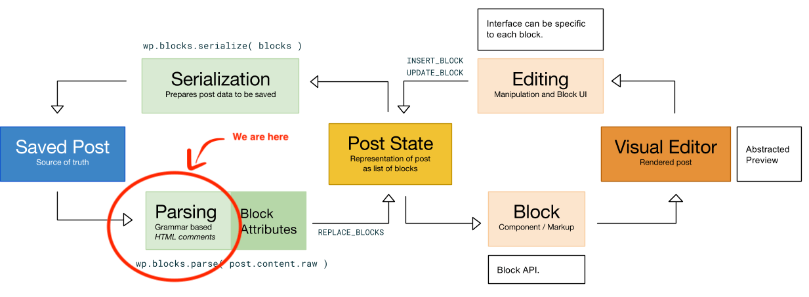

+++
title = "Prelude"
date = "2018-08-21"
+++

[At my work](https://automattic.com/), I had an opportunity to start an
experiment: Writing a single parser implementation in Rust for [the new
Gutenberg post format](https://github.com/WordPress/gutenberg), bound to
many platforms and environments.

<figure>

  

  <figcaption>

  Gutenberg's logo

  </figcaption>

</figure>

This series of posts is about those bindings, and explains how to send
Rust beyond earth, into many different galaxies. Rust will land in:

- [The WebAssembly
  galaxy](/2018-08-22-from-rust-to-beyond-the-webassembly-galaxy/index.md),
- [The ASM.js
  galaxy](/2018-08-28-from-rust-to-beyond-the-asm-js-galaxy/index.md),
- [The C
  galaxy](/2018-09-11-from-rust-to-beyond-the-c-galaxy/index.md),
- [The PHP
  galaxy](/2018-10-29-from-rust-to-beyond-the-php-galaxy/index.md),
  and
- *The NodeJS galaxy*.

The ship is currently flying into the Java galaxy, this series may
continue if the ship does not crash or has enough resources to survive!

## The Gutenberg post format

Let's introduce quickly what Gutenberg is, and why a new post format. If
you want an in-depth presentation, I highly recommend to read [The
Language of
Gutenberg](https://lamda.blog/2018/04/22/the-language-of-gutenberg/).
Note that this is *not* required for the reader to understand the
Gutenberg post format.

[Gutenberg](https://github.com/WordPress/gutenberg) is the next
WordPress editor. It is a little revolution on its own. The features it
unlocks are very powerful.

> The editor will create a new page- and post-building experience that
> makes writing rich posts effortless, and has “blocks” to make it easy
> what today might take shortcodes, custom HTML, or “mystery meat” embed
> discovery. — Matt Mullenweg

The format of a blog post was HTML. And it continues to be. However,
another semantics layer is added through annotations. Annotations are
written in comments and borrow the XML syntax, e.g.:

```xml
<!-- wp:ns/block-name {"attributes": "as JSON"} -->
  <p>phrase</p>
<!-- /wp:ns/block-name -->
```

The Gutenberg format provides 2 constructions: Block, and Phrase. The
example above contains both: There is a block wrapping a phrase. A
phrase is basically anything that is not a block. Let's describe the
example:

- It starts with an annotation (`<!-- … -->`),
- The `wp:` is mandatory to represent a Gutenberg block,
- It is followed by a fully qualified block name, which is a pair of an
  optional namespace (here sets to `ns`, defaults to `core`) and a block
  name (here sets to `block-name`), separated by a slash,
- A block has optional attributes encoded as a JSON object (see [RFC
  7159, Section 4, Objects](https://tools.ietf.org/html/rfc7159)),
- Finally, a block has optional children, i.e. an heterogeneous
  collection of blocks or phrases. In the example above, there is one
  child that is the phrase `<p>phrase</p>`. And the following example
  below shows a block with no child:

```xml
<!-- wp:ns/block-name {"attributes": "as JSON"} /-->
```

The complete grammar can be found in [the parser's
documentation](https://hywan.github.io/gutenberg-parser-rs/gutenberg_post_parser/parser/index.html).

Finally, the parser is used on the *editor* side, not on the *rendering*
side. Once rendered, the blog post is a regular HTML file. Some blocks
are dynamics though, but this is another topic.

<figure>

  

  <figcaption>

  The logic flow of the editor ([How Little Blocks
  Work](https://make.wordpress.org/core/2017/05/05/editor-how-little-blocks-work/))

  </figcaption>

</figure>

The grammar is relatively small. The challenges are however to be as
much performant and memory efficient as possible on many platforms. Some
posts can reach megabytes, and we don't want the parser to be the
bottleneck. Even if it is used when creating the post state (cf. the
schema above), we have measured several seconds to load some posts. Time
during which the user is blocked, and waits, or see an error. In other
scenarii, we have hit memory limit of the language's virtual machines.

Hence this experimental project! The current parsers are written in
JavaScript (with [PEG.js](https://pegjs.org/)) and in PHP (with
[`phpegjs`](https://github.com/nylen/phpegjs)). This Rust project
proposes a parser written in Rust, that can run in the JavaScript and in
the PHP virtual machines, and on many other platforms. Let's try to be
very performant and memory efficient!

## Why Rust?

That's an excellent question! Thanks for asking. I can summarize my
choice with a bullet list:

- It is fast, and we need speed,
- It is memory safe, and also memory efficient,
- No garbage collector, which simplifies memory management across
  environments,
- It can expose a C API ([with Foreign Function Interface,
  FFI](https://doc.rust-lang.org/std/ffi/index.html)), which eases the
  integration into multiple environments,
- It compiles to [many
  targets](https://doc.rust-lang.org/nightly/rustc/platform-support.html),
- Because I love it.

One of the goal of the experimentation is to maintain a single
implementation (maybe the future reference implementation) with multiple
bindings.

## The parser

The parser is written in Rust. It relies on the fabulous [nom
library](https://github.com/Geal/nom/).

<figure>

  

  <figcaption>

  *nom will happily take a byte out of your files* 🙂

  </figcaption>

</figure>

The source code is available in [the `src/` directory in the
repository](https://github.com/Hywan/gutenberg-parser-rs). It is very
small and fun to read.

The parser produces an Abstract Syntax Tree (AST) of the grammar, where
nodes of the tree are defined as:

```rust
pub enum Node<'a> {
    Block {
        name: (Input<'a>, Input<'a>),
        attributes: Option<Input<'a>>,
        children: Vec<Node<'a>>
    },
    Phrase(Input<'a>)
}
```

That's all! We find again the block name, the attributes and the
children, and the phrase. Block children are defined as a collection of
node, this is recursive. `Input<'a>` is defined as `&'a [u8]`, i.e. a
slice of bytes.

The main parser entry is [the `root`
function](https://hywan.github.io/gutenberg-parser-rs/gutenberg_post_parser/fn.root.html).
It represents the axiom of the grammar, and is defined as:

```rust
pub fn root(
    input: Input
) -> Result<(Input, Vec<ast::Node>), nom::Err<Input>>;
```

So the parser returns a collection of nodes in the best case. Here is an
simple example:

```rust
use gutenberg_post_parser::{root, ast::Node};

let input = &b"<!-- wp:foo {\"bar\": true} /-->"[..];
let output = Ok(
    (
        // The remaining data.
        &b""[..],

        // The Abstract Syntax Tree.
        vec![
            Node::Block {
                name: (&b"core"[..], &b"foo"[..]),
                attributes: Some(&b"{\"bar\": true}"[..]),
                children: vec![]
            }
        ]
    )
);

assert_eq!(root(input), output);
```

The `root` function and the AST will be the items we are going to use
and manipulate in the bindings. The internal items of the parser will
stay private.

## Bindings


From now, our goal is to expose the `root` function and the `Node` enum
in different platforms or environments. Ready?

3… 2… 1… lift-off!
