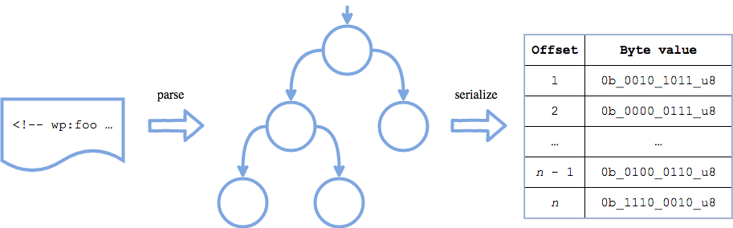
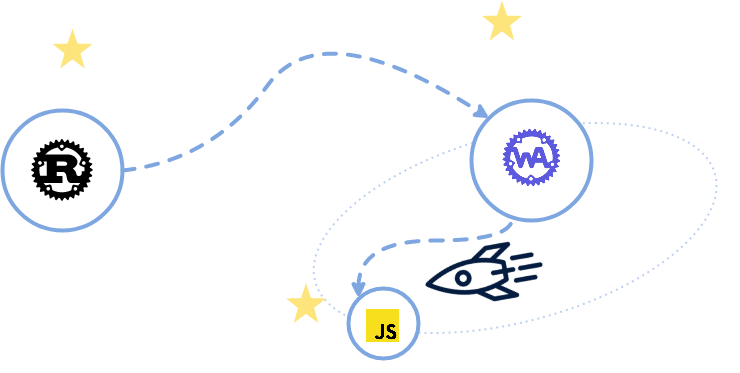

+++
title = "The WebAssembly galaxy"
date = "2018-08-22"
description = "In this episode, we explore the WebAssembly galaxy.\n\nWe first off present WebAssembly. Then we see how to write a Rust program tailored for WebAssembly. We continue by explaining how to run this WebAssembly module on a JavaScript host. It brings some complications, like how to flatten an Abstract Syntax Tree to get fast memory accesses between Rust and JavaScript. We continue by reducing the size of the WebAssembly module to make it as small as possible, smaller than a tiny image. Finally, we compare performance of this Rust to WebAssembly to JavaScript design versus the original PEG.js solution: is it faster? Oh yeah… it is!"
[taxonomies]
keywords=["rust", "binding", "gutenberg", "webassembly", "javascript", "asmjs"]
+++

The first galaxy that our Rust parser will explore is the WebAssembly
(Wasm) galaxy. This post will explain what WebAssembly is, how to
compile the parser into WebAssembly, and how to use the WebAssembly
binary with Javascript in a browser and with NodeJS.

## What is WebAssembly, and why?

If you already know WebAssembly, you can skip this section.

[WebAssembly](https://webassembly.org/) defines itself as:

> WebAssembly (abbreviated *Wasm*) is a binary instruction format for a
> stack-based virtual machine. Wasm is designed as a portable target for
> compilation of high-level languages like C/C++/Rust, enabling
> deployment on the web for client and server applications.

Should I say more? Probably, yes…

WebAssembly is a *new portable binary format*. Languages like C, C++, or
Rust already compiles to this target. It is the spirit successor of
[ASM.js](http://asmjs.org/). By spirit successor, I mean it is the same
people trying to extend the Web platform and to make the Web fast that
are working on both technologies. They share some design concepts too,
but that's not really important right now.

Before WebAssembly, programs had to compile to Javascript in order to
run on the Web platform. The resulting files were most of the time
large. And because the Web is a network, the files had to be downloaded,
and it took time. WebAssembly is designed to be encoded in a size- and
load-time efficient [binary
format](https://webassembly.org/docs/binary-encoding/).

WebAssembly is also faster than Javascript for many reasons. Despites
all the crazy optimisations engineers put in the Javascript virtual
machines, Javascript is a weakly and dynamically typed language, which
requires to be interpreted. WebAssembly aims to execute at native speed
by taking advantage of [common hardware
capabilities](https://webassembly.org/docs/portability/#assumptions-for-efficient-execution).
[WebAssembly also loads faster than
Javascript](https://hacks.mozilla.org/2018/01/making-webassembly-even-faster-firefoxs-new-streaming-and-tiering-compiler/)
because parsing and compiling happen while the binary is streamed from
the network. So once the binary is entirely fetched, it is ready to run:
No need to wait on the parser and the compiler before running the
program.

Today, and our blog series is a perfect example of that, it is possible
to write a Rust program, and to compile it to run on the Web platform.
Why? Because WebAssembly is implemented by [all major
browsers](https://caniuse.com/#search=wasm), and because it has been
designed for the Web: To live and run on the Web platform (like a
browser). But its portable aspect and [its safe and sandboxed memory
design](https://webassembly.org/docs/semantics/#linear-memory) make it a
good candidate to run outside of the Web platform (see [a serverless
Wasm framework](https://github.com/geal/serverless-wasm), or [an
application container built for
Wasm](https://github.com/losfair/IceCore)).

I think it is important to remind that WebAssembly is not here to
replace Javascript. It is just another technology which solves many
problems we can meet today, like load-time, safety, or speed.

## Rust 🚀 WebAssembly

<figure>


</figure>

[The Rust Wasm team](https://github.com/rustwasm/team) is a group of
people leading the effort of pushing Rust into WebAssembly with a set of
tools and integrations. [There is a
book](https://rustwasm.github.io/book/) explaining how to write a
WebAssembly program with Rust.

With the Gutenberg Rust parser, I didn't use tools like
[`wasm-bindgen`](https://github.com/rustwasm/wasm-bindgen/) (which is a
pure gem) when I started the project few months ago because I hit some
limitations. Note that some of them have been addressed since then!
Anyway, we will do most of the work by hand, and I think this is an
excellent way to understand how things work in the background. When you
are familiar with WebAssembly interactions, then `wasm-bindgen` is an
excellent tool to have within easy reach, because it abstracts all the
interactions and let you focus on your code logic instead.

I would like to remind the reader that the Gutenberg Rust parser exposes
one AST, and one `root` function (the axiom of the grammar),
respectively defined as:

```rust
pub enum Node<'a> {
    Block {
        name: (Input<'a>, Input<'a>),
        attributes: Option<Input<'a>>,
        children: Vec<Node<'a>>
    },
    Phrase(Input<'a>)
}
```

and

```rust
pub fn root(
    input: Input
) -> Result<(Input, Vec<ast::Node>), nom::Err<Input>>;
```

Knowing that, let's go!

### General design

Here is our general design or workflow:

1.  Javascript (for instance) writes the blog post to parse into the
    WebAssembly module memory,
2.  Javascript runs the `root` function by passing a pointer to the
    memory, and the length of the blog post,
3.  Rust reads the blog post from the memory, runs the Gutenberg parser,
    compiles the resulting AST into a sequence of bytes, and returns the
    pointer to this sequence of bytes to Javascript,
4.  Javascript reads the memory from the received pointer, and decodes
    the sequence of bytes as Javascript objects in order to recreate an
    AST with a friendly API.

Why a sequence of bytes? Because WebAssembly only supports integers and
floats, not strings or vectors, and also because our Rust parser takes a
slice of bytes as input, so this is handy.

We use the term *boundary layer* to refer to this Javascript piece of
code responsible to read from and write into the WebAssembly module
memory, and responsible of exposing a friendly API.

Now, we will focus on the Rust code. It consists of only 4 functions:

- `alloc` to allocate memory (exported),
- `dealloc` to deallocate memory (exported),
- `root` to run the parser (exported),
- `into_bytes` to transform the AST into a sequence of bytes.

[The entire code lands
here](https://github.com/Hywan/gutenberg-parser-rs/blob/master/bindings/wasm/src/lib.rs).
It is approximately 150 lines of code. We explain it.

### Memory allocation

Let's start by the memory allocator. I choose to use [`wee_alloc` for
the memory allocator](https://github.com/rustwasm/wee_alloc). It is
specifically designed for WebAssembly by being very small (less than a
kilobyte) and efficient.

The following piece of code describes the memory allocator setup and the
“prelude” for our code (enabling some compiler features, like `alloc`,
declaring external crates, some aliases, and declaring required function
like `panic`, `oom` etc.). This can be considered as a boilerplate:

```rust
#![no_std]
#![feature(
    alloc,
    alloc_error_handler,
    core_intrinsics,
    lang_items
)]

extern crate gutenberg_post_parser;
extern crate wee_alloc;
#[macro_use] extern crate alloc;

use gutenberg_post_parser::ast::Node;
use alloc::vec::Vec;
use core::{mem, slice};

#[global_allocator]
static ALLOC: wee_alloc::WeeAlloc = wee_alloc::WeeAlloc::INIT;

#[panic_handler]
fn panic(_info: &core::panic::PanicInfo) -> ! {
    unsafe { core::intrinsics::abort(); }
}

#[alloc_error_handler]
fn oom(_: core::alloc::Layout) -> ! {
    unsafe { core::intrinsics::abort(); }
}

// This is the definition of `std::ffi::c_void`, but Wasm runs without std in our case.
#[repr(u8)]
#[allow(non_camel_case_types)]
pub enum c_void {
    #[doc(hidden)]
    __variant1,

    #[doc(hidden)]
    __variant2
}
```

The Rust memory is the WebAssembly memory. Rust will allocate and
deallocate memory on its own, but Javascript for instance needs to
allocate and deallocate WebAssembly memory in order to
communicate/exchange data. So we need to export one function to allocate
memory and one function to deallocate memory.

Once again, this is almost a boilerplate. The `alloc` function creates
an empty vector of a specific capacity (because it is a linear segment
of memory), and returns a pointer to this empty vector:

```rust
#[no_mangle]
pub extern "C" fn alloc(capacity: usize) -> *mut c_void {
    let mut buffer = Vec::with_capacity(capacity);
    let pointer = buffer.as_mut_ptr();
    mem::forget(buffer);

    pointer as *mut c_void
}
```

Note the `#[no_mangle]` attribute that instructs the Rust compiler to
not mangle the function name, i.e. to not rename it. And `extern "C"` to
export the function in the WebAssembly module, so it is “public” from
outside the WebAssembly binary.

The code is pretty straightforward and matches what we announced
earlier: A `Vec` is allocated with a specific capacity, and the pointer
to this vector is returned. The important part is `mem::forget(buffer)`.
It is required so that Rust will *not* deallocate the vector once it
goes out of scope. Indeed, Rust enforces [Resource Acquisition Is
Initialization
(RAII)](https://en.wikipedia.org/wiki/Resource_acquisition_is_initialization),
so whenever an object goes out of scope, its destructor is called and
its owned resources are freed. This behavior shields against resource
leaks bugs, and this is why we will never have to manually free memory
or worry about memory leaks in Rust ([see some RAII
examples](https://doc.rust-lang.org/rust-by-example/scope/raii.html)).
In this case, we want to allocate and keep the allocation after the
function execution, hence [the `mem::forget`
call](https://doc.rust-lang.org/std/mem/fn.forget.html).

Let's jump on the `dealloc` function. The goal is to recreate a vector
based on a pointer and a capacity, and to let Rust drops it:

```rust
#[no_mangle]
pub extern "C" fn dealloc(pointer: *mut c_void, capacity: usize) {
    unsafe {
        let _ = Vec::from_raw_parts(pointer, 0, capacity);
    }
}
```

[The `Vec::from_raw_parts`
function](https://doc.rust-lang.org/std/vec/struct.Vec.html#method.from_raw_parts)
is marked as unsafe, so we need to delimit it in an `unsafe` block so
that the `dealloc` function is considered as safe.

The variable `_` contains our data to deallocate, and it goes out of
scope immediately, so Rust drops it.

### From input to a flat AST

Now the core of the binding! The `root` function reads the blog post to
parse based on a pointer and a length, then it parses it. If the result
is OK, it serializes the AST into a sequence of bytes, i.e. it flatten
it, otherwise it returns an empty sequence of bytes.

<figure>

  

  <figcaption>

   The image illustrates the flow of the data: first off there is a blog post;
   second there is the AST of the blog post; finally there is a linear byte-encoded
   representation of the AST of the blog post.

  </figcaption>

</figure>

The logic flow of the parser: The input on the left is parsed into an
AST, which is serialized into a flat sequence of bytes on the right.

```rust
#[no_mangle]
pub extern "C" fn root(pointer: *mut u8, length: usize) -> *mut u8 {
    let input = unsafe { slice::from_raw_parts(pointer, length) };
    let mut output = vec![];

    if let Ok((_remaining, nodes)) = gutenberg_post_parser::root(input) {
        // Compile the AST (nodes) into a sequence of bytes.
    }

    let pointer = output.as_mut_ptr();
    mem::forget(output);

    pointer
}
```

The variable `input` contains the blog post. It is fetched from memory
with a pointer and a length. The variable `output` is the sequence of
bytes the function will return. `gutenberg_post_parser::root(input)`
runs the parser. If parsing is OK, then the `nodes` are compiled into a
sequence of bytes (omitted for now). Then the pointer to the sequence of
bytes is grabbed, the Rust compiler is instructed to not drop it, and
finally the pointer is returned. The logic is again pretty
straightforward.

Now, let's focus on the AST to the sequence of bytes (`u8`) compilation.
All data the AST hold are already bytes, which makes the process easier.
The goal is only to flatten the AST:

- The first 4 bytes represent the number of nodes at the first level (4
  × `u8` represents `u32`) ,
- Next, if the node is `Block`:
  - The first byte is the node type: `1u8` for a block,
  - The second byte is the size of the block name,
  - The third to the sixth bytes are the size of the attributes,
  - The seventh byte is the number of node children the block has,
  - Next bytes are the block name,
  - Next bytes are the attributes (`&b"null"[..]` if none),
  - Next bytes are node children as a sequence of bytes,
- Next, if the node is `Phrase`:
  - The first byte is the node type: `2u8` for a phrase,
  - The second to the fifth bytes are the size of the phrase,
  - Next bytes are the phrase.

Here is the missing part of the `root` function:

```rust
if let Ok((_remaining, nodes)) = gutenberg_post_parser::root(input) {
    let nodes_length = u32_to_u8s(nodes.len() as u32);

    output.push(nodes_length.0);
    output.push(nodes_length.1);
    output.push(nodes_length.2);
    output.push(nodes_length.3);

    for node in nodes {
        into_bytes(&node, &mut output);
    }
}
```

And here is the `into_bytes` function:

```rust
fn into_bytes<'a>(node: &Node<'a>, output: &mut Vec<u8>) {
    match *node {
        Node::Block { name, attributes, ref children } => {
            let node_type = 1u8;
            let name_length = name.0.len() + name.1.len() + 1;
            let attributes_length = match attributes {
                Some(attributes) => attributes.len(),
                None => 4
            };
            let attributes_length_as_u8s = u32_to_u8s(attributes_length as u32);

            let number_of_children = children.len();
            output.push(node_type);
            output.push(name_length as u8);
            output.push(attributes_length_as_u8s.0);
            output.push(attributes_length_as_u8s.1);
            output.push(attributes_length_as_u8s.2);
            output.push(attributes_length_as_u8s.3);
            output.push(number_of_children as u8);

            output.extend(name.0);
            output.push(b'/');
            output.extend(name.1);

            if let Some(attributes) = attributes {
                output.extend(attributes);
            } else {
                output.extend(&b"null"[..]);
            }

            for child in children {
                into_bytes(&child, output);
            }
        },

        Node::Phrase(phrase) => {
            let node_type = 2u8;
            let phrase_length = phrase.len();

            output.push(node_type);

            let phrase_length_as_u8s = u32_to_u8s(phrase_length as u32);

            output.push(phrase_length_as_u8s.0);
            output.push(phrase_length_as_u8s.1);
            output.push(phrase_length_as_u8s.2);
            output.push(phrase_length_as_u8s.3);
            output.extend(phrase);
        }
    }
}
```

What I find interesting with this code is it reads just like the bullet
list above the code.

For the most curious, here is the `u32_to_u8s` function:

```rust
fn u32_to_u8s(x: u32) -> (u8, u8, u8, u8) {
    (
        ((x >> 24) & 0xff) as u8,
        ((x >> 16) & 0xff) as u8,
        ((x >> 8)  & 0xff) as u8,
        ( x        & 0xff) as u8
    )
}
```

Here we are. `alloc`, `dealloc`, `root`, and `into_bytes`. Four
functions, and everything is done.

### Producing and optimising the WebAssembly binary

To get a WebAssembly binary, the project has to be compiled to the
`wasm32-unknown-unknown` target. For now (and it will change in a near
future), the nightly toolchain is needed to compile the project, so make
sure you have the latest nightly version of `rustc` & co. installed with
`rustup update nightly`. Let's run `cargo`:

```sh
$ RUSTFLAGS='-g' cargo +nightly build --target wasm32-unknown-unknown --release
```

The WebAssembly binary weights 22kb. Our goal is to reduce the file
size. For that, the following tools will be required:

- [`wasm-gc`](https://github.com/alexcrichton/wasm-gc) to
  garbage-collect unused imports, internal functions, types etc.,
- [`wasm-snip`](https://github.com/rustwasm/wasm-snip) to mark some
  functions as unreachable, this is useful when the binary includes
  unused code that the linker were not able to remove,
- `wasm-opt` from the [Binaryen
  project](https://github.com/WebAssembly/binaryen), to optimise the
  binary,
- [`gzip`](http://www.gzip.org/) and
  [`brotli`](https://github.com/google/brotli) to compress the binary.

Basically, what we do is the following:

```sh
$ # Garbage-collect unused data.
$ wasm-gc gutenberg_post_parser.wasm

$ # Mark fmt and panicking as unreachable.
$ wasm-snip --snip-rust-fmt-code --snip-rust-panicking-code gutenberg_post_parser.wasm -o gutenberg_post_parser_snipped.wasm
$ mv gutenberg_post_parser_snipped.wasm gutenberg_post_parser.wasm

$ # Garbage-collect unreachable data.
$ wasm-gc gutenberg_post_parser.wasm

$ # Optimise for small size.
$ wasm-opt -Oz -o gutenberg_post_parser_opt.wasm gutenberg_post_parser.wasm
$ mv gutenberg_post_parser_opt.wasm gutenberg_post_parser.wasm

$ # Compress.
$ gzip --best --stdout gutenberg_post_parser.wasm > gutenberg_post_parser.wasm.gz
$ brotli --best --stdout --lgwin=24 gutenberg_post_parser.wasm > gutenberg_post_parser.wasm.br 
```

We end up with the following file sizes:

- `.wasm`: 16kb,
- `.wasm.gz`: 7.3kb,
- `.wasm.br`: 6.2kb.

Neat! [Brotli is implemented by most
browsers](https://caniuse.com/#search=brotli), so when the client sends
`Accept-Encoding: br`, the server can response with the `.wasm.br` file.

To give you a feeling of what 6.2kb represent, the following image also
weights 6.2kb:

<figure>

  

  <figcaption>

  An image that is as weight as our compressed WebAssembly module.

  </figcaption>

</figure>

The WebAssembly binary is ready to run!

## WebAssembly 🚀 Javascript

<figure role="presentation">

  

</figure>

In this section, we assume Javascript runs in a browser. Thus, what we
need to do is the following:

1.  Load/stream and instanciate the WebAssembly binary,
2.  Write the blog post to parse in the WebAssembly module memory,
3.  Call the `root` function on the parser,
4.  Read the WebAssembly module memory to load the flat AST (a sequence
    of bytes) and decode it to build a “Javascript AST” (with our own
    objects).

[The entire code lands
here](https://github.com/Hywan/gutenberg-parser-rs/blob/master/bindings/wasm/bin/gutenberg_post_parser.mjs).
It is approximately 150 lines of code too. I won't explain the whole
code since some parts of it is the “friendly API” that is exposed to the
user. So I will rather explain the major pieces.

### Loading/streaming and instanciating

[The `WebAssembly`
API](https://developer.mozilla.org/en-US/docs/Web/JavaScript/Reference/Global_Objects/WebAssembly)
exposes multiple ways to load a WebAssembly binary. The best you can use
is [the `WebAssembly.instanciateStreaming`
function](https://developer.mozilla.org/en-US/docs/Web/JavaScript/Reference/Global_Objects/WebAssembly/instantiateStreaming):
It streams the binary and compiles it in the same time, nothing is
blocking. This API relies on [the `Fetch`
API](https://developer.mozilla.org/en-US/docs/Web/API/Fetch_API). You
might have guessed it: It is asynchronous (it returns a promise).
WebAssembly itself is not asynchronous (except if you use thread), but
the instanciation step is. It is possible to avoid that, but this is
tricky, and Google Chrome has a strong limit of 4kb for the binary size
which will make you give up quickly.

To be able to stream the WebAssembly binary, the server must send the
`application/wasm` MIME type (with the `Content-Type` header).

Let's instanciate our WebAssembly:

```js
const url = '/gutenberg_post_parser.wasm';
const wasm =
    WebAssembly.
        instantiateStreaming(fetch(url), {}).
        then(object => object.instance).
        then(instance => { /* step 2 */ });
```

The WebAssembly binary has been instanciated! Now we can move to the
next step.

### Last polish before running the parser

Remember that the WebAssembly binary exports 3 functions: `alloc`,
`dealloc`, and `root`. They can be found on the `exports` property,
along with the memory. Let's write that:

```js
        then(instance => {
            const Module = {
                alloc: instance.exports.alloc,
                dealloc: instance.exports.dealloc,
                root: instance.exports.root,
                memory: instance.exports.memory
            };

            runParser(Module, '<!-- wp:foo /-->xyz');
        });
```

Great, everything is ready to write the `runParser` function!

### The parser runner

As a reminder, this function has to: Write the `input` (the blog post to
parse) in the WebAssembly module memory (`Module.memory`), to call the
`root` function (`Module.root`), and to read the result from the
WebAssembly module memory. Let's do that:

```js
function runParser(Module, raw_input) {
    const input = new TextEncoder().encode(raw_input);
    const input_pointer = writeBuffer(Module, input);
    const output_pointer = Module.root(input_pointer, input.length);
    const result = readNodes(Module, output_pointer);

    Module.dealloc(input_pointer, input.length);

    return result;
}
```

In details:

- The `raw_input` is encoded into a sequence of bytes with [the
  `TextEncoder`API](https://developer.mozilla.org/en-US/docs/Web/API/TextEncoder),
  in `input`,
- The input is written into the WebAssembly memory module with
  `writeBuffer` and its pointer is returned,
- Then the `root` function is called with the pointer to the input and
  the length of the input as expected, and the pointer to the output is
  returned,
- Then the output is decoded,
- And finally, the input is deallocated. The output of the parser will
  be deallocated in the `readNodes` function because its length is
  unknown at this step.

Great! So we have 2 functions to write right now: `writeBuffer`​ and
`readNodes`.

### Writing the data in memory

Let's go with the first one, `writeBuffer`:

```js
function writeBuffer(Module, buffer) {
    const buffer_length = buffer.length;
    const pointer = Module.alloc(buffer_length);
    const memory = new Uint8Array(Module.memory.buffer);

    for (let i = 0; i < buffer_length; ++i) {
        memory[pointer + i] = buffer[i];
    }

    return pointer;
}
```

In details:

- The length of the buffer is read in `buffer_length`,
- A space in memory is allocated to write the buffer,
- Then a `uint8` view of the buffer is instanciated, which means that
  the buffer will be viewed as a sequence of `u8`, exactly what Rust
  expects,
- Finally the buffer is copied into the memory with a loop, that's very
  basic, and return the pointer.

Note that, unlike C strings, adding a `NUL` byte at the end is not
mandatory. This is just the raw data (on the Rust side, we read it with
`slice::from_raw_parts`, slice is a very simple structure).

### Reading the output of the parser

So at this step, the input has been written in memory, and the `root`
function has been called so it means the parser has run. It has returned
a pointer to the output (the result) and we now have to read it and
decode it.

Remind that the first 4 bytes encodes the number of nodes we have to
read. Let's go!

```js
function readNodes(Module, start_pointer) {
    const buffer = new Uint8Array(Module.memory.buffer.slice(start_pointer));
    const number_of_nodes = u8s_to_u32(buffer[0], buffer[1], buffer[2], buffer[3]);

    if (0 >= number_of_nodes) {
        return null;
    }

    const nodes = [];
    let offset = 4;
    let end_offset;

    for (let i = 0; i < number_of_nodes; ++i) {
        const last_offset = readNode(buffer, offset, nodes);

        offset = end_offset = last_offset;
    }

    Module.dealloc(start_pointer, start_pointer + end_offset);

    return nodes;
}
```

In details:

- A `uint8` view of the memory is instanciated… more precisely: A slice
  of the memory starting at `start_pointer`,
- The number of nodes is read, then all nodes are read,
- And finally, the output of the parser is deallocated.

For the record, here is the `u8s_to_u32` function, this is the exact
opposite of `u32_to_u8s`:

```js
function u8s_to_u32(o, p, q, r) {
    return (o << 24) | (p << 16) | (q << 8) | r;
}
```

And I will also share the `readNode` function, but I won't explain the
details. This is just the decoding part of the output from the parser.

```js
function readNode(buffer, offset, nodes) {
    const node_type = buffer[offset];

    // Block.
    if (1 === node_type) {
        const name_length = buffer[offset + 1];
        const attributes_length = u8s_to_u32(buffer[offset + 2], buffer[offset + 3], buffer[offset + 4], buffer[offset + 5]);
        const number_of_children = buffer[offset + 6];

        let payload_offset = offset + 7;
        let next_payload_offset = payload_offset + name_length;

        const name = new TextDecoder().decode(buffer.slice(payload_offset, next_payload_offset));

        payload_offset = next_payload_offset;
        next_payload_offset += attributes_length;

        const attributes = JSON.parse(new TextDecoder().decode(buffer.slice(payload_offset, next_payload_offset)));

        payload_offset = next_payload_offset;
        let end_offset = payload_offset;

        const children = [];

        for (let i = 0; i < number_of_children; ++i) {
            const last_offset = readNode(buffer, payload_offset, children);

            payload_offset = end_offset = last_offset;
        }

        nodes.push(new Block(name, attributes, children));

        return end_offset;
    }
    // Phrase.
    else if (2 === node_type) {
        const phrase_length = u8s_to_u32(buffer[offset + 1], buffer[offset + 2], buffer[offset + 3], buffer[offset + 4]);
        const phrase_offset = offset + 5;
        const phrase = new TextDecoder().decode(buffer.slice(phrase_offset, phrase_offset + phrase_length));

        nodes.push(new Phrase(phrase));

        return phrase_offset + phrase_length;
    } else {
        console.error('unknown node type', node_type);
    }
}
```

Note that this code is pretty simple and easy to optimise by the
Javascript virtual machine. It is almost important to note that this is
not the original code. The original version is a little more optimised
here and there, but they are very close.

And that's all! We have successfully read and decoded the output of the
parser! We just need to write the `Block` and `Phrase` classes like
this:

```js
class Block {
    constructor(name, attributes, children) {
        this.name = name;
        this.attributes = attributes;
        this.children = children;
    }
}

class Phrase {
    constructor(phrase) {
        this.phrase = phrase;
    }
}
```

The final output will be an array of those objects. Easy!

## WebAssembly 🚀 NodeJS

<figure role="presentation">

  

</figure>

The differences between the Javascript version and the NodeJS version
are few:

- The `Fetch` API does not exist in NodeJS, so the WebAssembly binary
  has to be instanciated with a buffer directly, like this:
  `WebAssembly.instantiate(fs.readFileSync(url), {})`,
- The `TextEncoder` and `TextDecoder` objects do not exist as global
  objects, they are in `util.TextEncoder` and `util.TextDecoder`.

In order to share the code between both environments, it is possible to
write the boundary layer (the Javascript code we wrote) in a `.mjs`
file, aka ECMAScript Module. It allows to write something like
`import { Gutenberg_Post_Parser } from './gutenberg_post_parser.mjs'`
for example (considering the whole code we wrote before is a class). On
the browser side, the script must be loaded
with`<script type="module" src="…" />`, and on the NodeJS side, `node`
must run with the `--experimental-modules` flag. I can recommend you
this talk [*Please wait… loading: a tale of two loaders* by Myles
Borins](https://www.youtube.com/watch?v=35ZMoH8T-gc&index=4&list=PLOkMRkzDhWGX_4YWI4ZYGbwFPqKnDRudf&t=0s)
at the JSConf EU 2018 to understand all the story about that.

[The entire code lands
here](https://github.com/Hywan/gutenberg-parser-rs/blob/master/bindings/wasm/bin/index.mjs).

## Conclusion

We have seen in details how to write a real world parser in Rust, how to
compile it into a WebAssembly binary, and how to use it with Javascript
and with NodeJS.

The parser can be used in a browser with regular Javascript code, or as
a CLI with NodeJS, or on any platforms NodeJS supports.

The Rust part for WebAssembly plus the Javascript part totals 313 lines
of code. This is a tiny surface of code to review and to maintain
compared to writing a Javascript parser from scratch.

Another argument is the safety and performance. Rust is memory safe, we
know that. It is also performant, but is it still true for the
WebAssembly target? The following table shows the benchmark results of
the actual Javascript parser for the Gutenberg project (implemented with
[PEG.js](https://pegjs.org/)), against this project: The Rust parser as
a WebAssembly binary.

<figure>

  |  | Javascript parser (ms) | Rust parser as a WebAssembly binary (ms) | speedup |
  |-|-|-|-|
  | [`demo-post.html`](https://raw.githubusercontent.com/dmsnell/gutenberg-document-library/master/library/demo-post.html) | 13.167 | 0.252 | × 52 |
  | [`shortcode-shortcomings.html`](https://raw.githubusercontent.com/dmsnell/gutenberg-document-library/master/library/shortcode-shortcomings.html) | 26.784 | 0.271 | × 98 |
  | [`redesigning-chrome-desktop.html`](https://raw.githubusercontent.com/dmsnell/gutenberg-document-library/master/library/redesigning-chrome-desktop.html) | 75.500 | 0.918 | × 82 |
  | [`web-at-maximum-fps.html`](https://raw.githubusercontent.com/dmsnell/gutenberg-document-library/master/library/web-at-maximum-fps.html) | 88.118 | 0.901 | × 98 |
  | [`early-adopting-the-future.html`](https://raw.githubusercontent.com/dmsnell/gutenberg-document-library/master/library/early-adopting-the-future.html) | 201.011 | 3.329 | × 60 |
  | [`pygmalian-raw-html.html`](https://raw.githubusercontent.com/dmsnell/gutenberg-document-library/master/library/pygmalian-raw-html.html) | 311.416 | 2.692 | × 116 |
  | [`moby-dick-parsed.html`](https://raw.githubusercontent.com/dmsnell/gutenberg-document-library/master/library/moby-dick-parsed.html) | 2,466.533 | 25.14 | × 98 |

  <figcaption>

  Benchmarks between Javascript parser and Rust parser as a WebAssembly binary.

  </figcaption>

</figure>

The WebAssembly binary is in average 86 times faster than the actual
Javascript implementation. The median of the speedup is 98. Some edge
cases are very interesting, like `moby-dick-parsed.html` where it takes
2.5s with the Javascript parser against 25ms with WebAssembly.

So not only it is safer, but it is faster than Javascript in this case.
And it is only 300 lines of code.

Note that WebAssembly does not support SIMD yet: It is still [a
proposal](https://github.com/WebAssembly/simd/blob/master/proposals/simd/SIMD.md).
Rust is gently supporting it ([example with PR
\#549](https://github.com/rust-lang-nursery/stdsimd/pull/549)). It will
dramatically improve the performances!

We will see in the next episodes of this series that Rust can reach a
lot of galaxies, and the more it travels, the more it gets interesting.

Thanks for reading!
