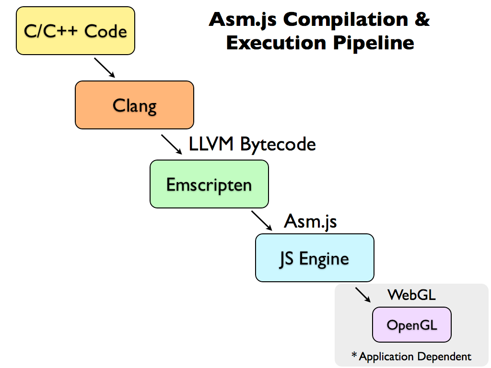

+++
title = "The ASM.js galaxy"
date = "2018-08-28"
[taxonomies]
keywords=["rust", "binding", "gutenberg", "webassembly", "javascript", "asmjs"]
+++

The second galaxy that our Rust parser will explore is the ASM.js
galaxy. This post will explain what ASM.js is, how to compile the parser
into ASM.js, and how to use the ASM.js module with Javascript in a
browser. The goal is to use ASM.js as a fallback to WebAssembly when it
is not available. I highly recommend to read [the previous
episode](@/series/from-rust-to-beyond/2018-08-22-the-webassembly-galaxy/index.md)
about WebAssembly since they have a lot in common.

## What is ASM.js, and why?

The main programming language on the Web is Javascript. Applications
that want to exist on the Web had to compile to Javascript, like for
example games. But a problem occurs: The resulting file is heavy (hence
WebAssembly) and Javascript virtual machines have difficulties to
optimise this particular code, resulting in slow or inefficient
executions (considering the example of games). Also —in this context—
Javascript is a compilation target, and as such, some language
constructions are useless (like `eval`).

So what if a “new” language can be a compilation target and still be
executed by Javascript virtual machines? This is WebAssembly today, but
in 2013, the solution was [ASM.js](http://asmjs.org/):

> **asm.js**, a strict subset of Javascript that can be used as a
> low-level, efficient target language for compilers. This sublanguage
> effectively describes a sandboxed virtual machine for memory-unsafe
> languages like C or C++. A combination of static and dynamic
> validation allows Javascript engines to employ an ahead-of-time (AOT)
> optimizing compilation strategy for valid asm.js code.

So an ASM.js program is a regular Javascript program. It is not a new
language but a subset of it. It can be executed by any Javascript
virtual machines. However, the specific usage of the magic statement
`'use asm';` instructs the virtual machine to optimise the program with
an ASM.js “engine”.

ASM.js introduces types by using arithmetical operators as an annotation
system. For instance, `x | 0` annotes `x` to be an integer, `+x`
annotates `x` to be a double, and `fround(x)` annotates `x` to be a
float. The following example declares a function
`fn increment(x: u32) -> u32`:

```js
function increment(x) {
    x = x | 0;
    return (x + 1) | 0;
}
```

Another important difference is that ASM.js works by module in order to
isolate them from Javascript. A module is a function that takes 3
arguments:

1.  `stdlib`, an object with references to standard library APIs,
2.  `foreign`, an object with user-defined functionalities (such as
    sending something over a WebSocket),
3.  `heap`, an array buffer representing the memory (because memory is
    manually managed).

But it's still Javascript. So the good news is that if your virtual
machine has no specific optimisations for ASM.js, it is executed as any
regular Javascript program. And if it does, then you get a pleasant
boost.

<figure>

  

  <figcaption>

  A graph showing 3 benchmarks running against different Javascript engines:
  Firefox, Firefox + asm.js, Google, and native.


  </figcaption>

</figure>

Remember that ASM.js has been designed to be a compilation target. So
normally you don't have to care about that because it is the role of the
compiler. The typical compilation and execution pipeline from C or C++
to the Web looks like this:

<figure>

  

  <figcaption>

  Classical ASM.js compilation and execution pipeline from C or C++ to the Web.

  </figcaption>

</figure>

[Emscripten](http://kripken.github.io/emscripten-site/), as seen in the
schema above, is a very important project in this whole evolution of the
Web platform. Emscripten is:

> a toolchain for compiling to asm.js and WebAssembly, built using LLVM,
> that lets you run C and C++ on the web at near-native speed without
> plugins.

You are very likely to see this name one day or another if you work with
ASM.js or WebAssembly.

I will not explain deeply what ASM.js is with a lot of examples. I
recommend instead to read [Asm.js: The Javascript Compile
Target](https://johnresig.com/blog/asmjs-javascript-compile-target/) by
John Resig, or [Big Web app? Compile
it!](http://kripken.github.io/mloc_emscripten_talk/) by Alon Zakai.

Our process will be different though. We will not compile our Rust code
directly to ASM.js, but instead, we will compile it to WebAssembly,
which in turn will be compiled into ASM.js.

## Rust 🚀 ASM.js


This episode will be very short, and somehow the most easiest one. To
compile Rust to ASM.js, you need to first compile it to WebAssembly
([see the previous
episode](@/series/from-rust-to-beyond/2018-08-22-the-webassembly-galaxy/index.md)),
and then compile the WebAssembly binary into ASM.js.

Actually, ASM.js is mostly required when the browser does not support
WebAssembly, like Internet Explorer. It is essentially a fallback to run
our program on the Web.

The workflow is the following:

1.  Compile your Rust project into WebAssembly,
2.  Compile your WebAssembly binary into an ASM.js module,
3.  Optimise and shrink the ASM.js module.

[The wasm2js tool](https://github.com/WebAssembly/binaryen) will be your
best companion to compile the WebAssembly binary into an ASM.js module.
It is part of Binaryen project. Then, assuming we have the WebAssembly
binary of our program, all we have to do is:

```sh
$ wasm2js --pedantic --output gutenberg_post_parser.asm.js gutenberg_post_parser.wasm
```

At this step, the `gutenberg_post_parser.asm.js` weights 212kb. The file
contains ECMAScript 6 code. And remember that old browsers are
considered, like Internet Explorer, so the code needs to be transformed
a little bit. To optimise and shrink the ASM.js module, we will use [the
`uglify-es` tool](https://github.com/mishoo/UglifyJS2/tree/harmony),
like this:

```sh
$ # Transform code, and embed in a function.
$ sed -i '' '1s/^/function GUTENBERG_POST_PARSER_ASM_MODULE() {/; s/export //' gutenberg_post_parser.asm.js
$ echo 'return { root, alloc, dealloc, memory }; }' >> gutenberg_post_parser.asm.js

$ # Shrink the code.
$ uglifyjs --compress --mangle --output .temp.asm.js gutenberg_post_parser.asm.js
$ mv .temp.asm.js gutenberg_post_parser.asm.js
```

Just like we did for the WebAssembly binary, we can compress the
resulting files with [`gzip`](http://www.gzip.org/) and
[`brotli`](https://github.com/google/brotli):

```sh
$ # Compress.
$ gzip --best --stdout gutenberg_post_parser.asm.js > gutenberg_post_parser.asm.js.gz
$ brotli --best --stdout --lgwin=24 gutenberg_post_parser.asm.js > gutenberg_post_parser.asm.js.br
```

We end up with the following file sizes:

- `.asm.js`: 54kb,
- `.asm.js.gz`: 13kb,
- `.asm.js.br`: 11kb.

That's again pretty small!

When you think about it, this is a lot of transformations: From Rust to
WebAssembly to Javascript/ASM.js… The amount of tools is rather small
compared to the amount of work. It shows a well-designed pipeline and a
collaboration between many groups of people.

Aside: If you are reading this post, I assume you are developers. And as
such, I'm sure you can spend hours looking at a source code like if it
is a master painting. Did you ever wonder what a Rust program looks like
once compiled to Javascript? See bellow:

<figure>

  

  <figcaption>

  A Rust program compiled as WebAssembly compiled as ASM.js.

  </figcaption>

</figure>

I like it probably too much.

## ASM.js 🚀 Javascript

The resulting `gutenberg_post_parser.asm.js` file contains a single
function named `GUTENBERG_POST_PARSER_ASM_MODULE` which returns an
object pointing to 4 private functions:

1.  `root`, the axiom of our grammar,
2.  `alloc`, to allocate memory,
3.  `dealloc`, to deallocate memory, and
4.  `memory`, the memory buffer.

It sounds familiar if you have read [the previous episode with
WebAssembly](@/series/from-rust-to-beyond/2018-08-22-the-webassembly-galaxy/index.md).
Don't expect `root` to return a full AST: It will return a pointer to
the memory, and the data need to be encoded and decoded, and to write
into and to read from the memory the same way. Yes, the same way. *The
exact same way*. So the code of the boundary layer is strictly the same.
Do you remember the `Module` object in our WebAssembly Javascript
boundary? This is exactly what the `GUTENBERG_POST_PARSER_ASM_MODULE`
function returns. You can replace `Module` by the returned object, *et
voilà*!

[The entired code lands
here](https://github.com/Hywan/gutenberg-parser-rs/blob/master/bindings/asmjs/bin/gutenberg_post_parser.asm.mjs).
It completely reuses the Javascript boundary layer for WebAssembly. It
just sets the `Module` differently, and it does not load the WebAssembly
binary. Consequently, the ASM.js boundary layer is made of 34 lines of
code, only 🙃. It compresses to 218 bytes.

## Conclusion

We have seen that ASM.js can be fallback to WebAssembly in environments
that only support Javascript (like Internet Explorer), with or without
ASM.js optimisations.

The resulting ASM.js file and its boundary layer are quite small. By
design, the ASM.js boundary layer reuses almost the entire WebAssembly
boundary layer. Therefore there is again a tiny surface of code to
review and to maintain, which is helpful.

We have seen in the previous episode that Rust is very fast. We have
been able to observe the same statement for WebAssembly compared to the
actual Javascript parser for the Gutenberg project. However, is it still
true for the ASM.js module? In this case, ASM.js is a fallback, and like
all fallbacks, they are notably slower than the targeted
implementations. Let's run the same benchmark but use the Rust parser as
an ASM.js module:

<figure>

  | | Javascript parser (ms) | Rust parser as an ASM.js module (ms) | speedup |
  |-|-|-|-|
  | [`demo-post.html`](https://raw.githubusercontent.com/dmsnell/gutenberg-document-library/master/library/demo-post.html) | 15.368 | 2.718 | × 6 |
  | [`shortcode-shortcomings.html`](https://raw.githubusercontent.com/dmsnell/gutenberg-document-library/master/library/shortcode-shortcomings.html) | 31.022 | 8.004 | × 4 |
  | [`redesigning-chrome-desktop.html`](https://raw.githubusercontent.com/dmsnell/gutenberg-document-library/master/library/redesigning-chrome-desktop.html) | 106.416 | 19.223 | × 6 |
  | [`web-at-maximum-fps.html`](https://raw.githubusercontent.com/dmsnell/gutenberg-document-library/master/library/web-at-maximum-fps.html) | 82.92 | 27.197 | × 3 |
  | [`early-adopting-the-future.html`](https://raw.githubusercontent.com/dmsnell/gutenberg-document-library/master/library/early-adopting-the-future.html) | 119.880 | 38.321 | × 3 |
  | [`pygmalian-raw-html.html`](https://raw.githubusercontent.com/dmsnell/gutenberg-document-library/master/library/pygmalian-raw-html.html) | 349.075 | 23.656 | × 15 |
  | [`moby-dick-parsed.html`](https://raw.githubusercontent.com/dmsnell/gutenberg-document-library/master/library/moby-dick-parsed.html) | 2,543.75 | 361.423 | × 7 |

  <figcaption>

  Benchmark between Javascript parser and Rust parser as an ASM.js module.

  </figcaption>

</figure>

The ASM.js module of the Rust parser is in average 6 times faster than
the actual Javascript implementation. The median speedup is 6. That's
far from the WebAssembly results, but this is a fallback, and in
average, it is 6 times faster, which is really great!

So not only the whole pipeline is safer because it starts from Rust, but
it ends to be faster than Javascript.

We will see in the next episodes of this series that Rust can reach a
lot of galaxies, and the more it travels, the more it gets interesting.

Thanks for reading!
