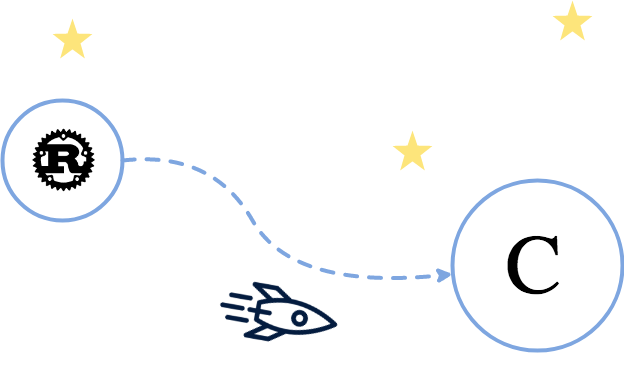
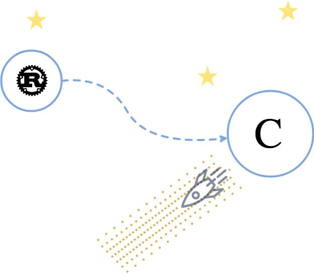

+++
title = "The C galaxy"
date = "2018-09-11"
description = "C is the _lingua franca_ of many programming languages. In this episode, we will approach the famous Foreign Function Interface (FFI) by generating a C API in Rust. We will continue by automatically generating C headers so that our interfaces are never outdated. Finally, we will write a small C programs just to test everything works as expected. After all, C is a trampoline to reach other galaxies."
[taxonomies]
keywords=["rust", "binding", "gutenberg", "c", "ffi"]
+++

The galaxy we will explore today is the C galaxy. This post will explain
what C is (shortly), how to compile any Rust program in C in theory, and
how to do that practically with our Rust parser from the Rust side and
the C side. We will also see how to test such a binding.

## What is C, and why?

[C](https://en.wikipedia.org/wiki/C_(programming_language)) is probably
the most used and known programming language in the world. Quoting
Wikipedia:

> C […] is a general-purpose, imperative computer programming
> language, supporting structured programming, lexical variable scope
> and recursion, while a static type system prevents many unintended
> operations. By design, C provides constructs that map efficiently to
> typical machine instructions, and therefore it has found lasting use
> in applications that had formerly been coded in assembly language,
> including operating systems, as well as various application software
> for computers ranging from supercomputers to embedded systems.

<figure>

  

  <figcaption>

   Dennis Ritchie, the inventor of the C language.

  </figcaption>

</figure>

The impact of C is probably without precedent on the progamming language
world. Almost everything is written in C, starting with operating
systems. Today, it is one of the few common denominator between any
programs on any systems on any machines in the world. In other words,
being compatible with C opens a large door to everything. Your program
will be able to talk directly to any program easily.

Because languages like PHP or Python are written in C, in our particular
Gutenberg parser usecase, it means that the parser can be embedded and
used by PHP or Python directly, with almost no overhead. Neat!

## Rust 🚀 C

<figure role="presentation">

  

</figure>

In order to use Rust from C, one may need 2 elements:

1. A static library (`.a` file),
2. A header file (`.h` file).

### The theory

To compile a Rust project into a static library, the `crate-type`
property must contain the `staticlib` value. Let's edit the `Cargo.toml`
file such as:

```toml
[lib]
name = "gutenberg_post_parser"
crate-type = ["staticlib"]
```

Once `cargo build --release` is run, a `libgutenberg_post_parser.a` file
is created in `target/release/`. Done. `cargo` and `rustc` make this
step really a doddle.

Now the header file. It can be written manually, but it's tedious and it
gets easily outdated. The goal is to _automatically_ generate it. Enter
[`cbindgen`](https://github.com/eqrion/cbindgen/):

> `cbindgen` can be used to generate C bindings for Rust code. It is
> currently being developed to support creating bindings for
> [WebRender](https://github.com/servo/webrender/), but has been
> designed to support any project.

To install `cbindgen`, edit your `Cargo.toml` file, such as:

```toml
[package]
build = "build.rs"

[build-dependencies]
cbindgen = "^0.6.0"
```

Actually, `cbindgen` comes in 2 flavors: CLI executable, or a library. I
prefer to use the library approach, which makes installation easier.

Note that Cargo has been instructed to use the `build.rs` file to build
the project. This file is an appropriate place to generate the C headers
file with `cbindgen`. Let's write it!

```rust
extern crate cbindgen;

fn main() {
    let crate_dir = std::env::var("CARGO_MANIFEST_DIR").unwrap();

    cbindgen::generate(crate_dir)
        .expect("Unable to generate C bindings.")
        .write_to_file("dist/gutenberg_post_parser.h");
}
```

With those information, `cbindgen` will scan the source code of the
project and will generate C headers automatically in the
`dist/gutenberg_post_parser.h` header file. Scanning will be detailed in
a moment, but before that, let's quickly see how to control the content
of the header file. With the code snippet above, `cbindgen` will look
for a `cbindgen.toml` configuration file in the `CARGO_MANIFEST_DIR`
directory, i.e. the root of your crate. Mine looks like this:

```toml
header = """
/*

Gutengerg Post Parser, the C bindings.

Warning, this file is autogenerated by `cbindgen`.
Do not modify this manually.

*/"""
tab_width = 4
language = "C"
```

It describes itself quite easily. [The documentation details the
configuration](https://github.com/eqrion/cbindgen/#configuration) very
well.

`cbindgen` will scan the code and will stop on `struct`s or `enum`s that
have the decorator `#[repr(C)]`, `#[repr(_size_)]` or
`#[repr(transparent)]`, or functions that are marked as `extern "C"` and
are public. So when one writes:

```rust
#[repr(C)]
pub struct Slice {
    pointer: *const c_char,
    length: usize
}

#[repr(C)]
pub enum Option {
    Some(Slice),
    None
}

#[no_mangle]
pub extern "C" parse(pointer: *const c_char) -> c_void { … }
```

Then `cbindgen` will generate this:

```c
// … header comment …

typedef struct {
    const char *pointer;
    uintptr_t length;
} Slice;

typedef enum {
    Some,
    None,
} Option_Tag;

typedef struct {
    Slice _0;
} Some_Body;

typedef struct {
    Option_Tag tag;
    union {
        Some_Body some;
    };
} Option;

void parse(const char *pointer);
```

It works; Great!

Note the `#[no_mangle]` that decorates the Rust `parse` function. It
instructs the compiler to not rename the function, so that the function
has the same name from the perspective of C.

OK, that's all for the theory. Let's practise now, we have a parser to
bind to C!

### Practise

We want to bind a function named `parse`. The function outputs an AST
representing the language being analysed. [For the
recall](@/series/from-rust-to-beyond/2018-08-21-prelude/index.md), the
original AST looks like this:

```rust
pub enum Node<'a> {
    Block {
        name: (Input<'a>, Input<'a>),
        attributes: Option<Input<'a>>,
        children: Vec<Node<'a>>
    },
    Phase(Input<'a>)
}
```

This AST is defined in the Rust parser. The Rust binding to C will
transform this AST into another set of structs and enums for C. It is
mandatory only for types that are directly exposed to C, not internal
types that Rust uses. Let's start by defining `Node`:

```rust
#[repr(C)]
pub enum Node {
    Block {
        namespace: Slice_c_char,
        name: Slice_c_char,
        attributes: Option_c_char,
        children: *const c_void
    },
    Phrase(Slice_c_char)
}
```

Some immediate thoughts:

- The structure `Slice_c_char` emulates Rust slices (see below),
- The enum `Option_c_char` emulates `Option` (see below),
- The field `children` has type `*const c_void`. It should be
  `*const Vector_Node` (our definition of `Vector`), but the definition
  of `Node` is based on `Vector_Node` and vice versa. This [cyclical
  definition case is unsupported by `cbindgen` so
  far](https://github.com/eqrion/cbindgen/issues/43). So… yes, it is
  defined as a `void` pointer, and will be casted later in C,
- The fields `namespace` and `name` are originally a tuple in Rust.
  Tuples have no equivalent in C with `cbindgen`, so two fields are used
  instead.

Let's define `Slice_c_char`:

```rust
#[repr(C)]
pub struct Slice_c_char {
    pointer: *const c_char,
    length: usize
}
```

This definition borrows the semantics of [Rust'
slices](https://doc.rust-lang.org/std/primitive.slice.html). The major
benefit is that there is no copy when binding a Rust slice to this
structure.

Let's define `Option_c_char`:

```rust
#[repr(C)]
pub enum Option_c_char {
    Some(Slice_c_char),
    None
}
```

Finally, we need to define `Vector_Node` and our own `Result` for C.
They mimic the Rust semantics closely:

```rust
#[repr(C)]
pub struct Vector_Node {
    buffer: *const Node,
    length: usize
}

#[repr(C)]
pub enum Result {
    Ok(Vector_Node),
    Err
}
```

Alright, all types are declared! It's time to write the `parse`
function:

```rust
#[no_mangle]
pub extern "C" fn parse(pointer: *const c_char) -> Result {
    …
}
```

The function takes a pointer from C. It means that the data to analyse
(i.e. the Gutenberg blog post) is allocated and owned by C: The memory
is allocated on the C side, and Rust is only responsible of the parsing.
This is where Rust shines: No copy, no clone, no memory mess, only
pointers to this data will be returned to C as slices and vectors.

The workflow will be the following:

- First thing to do when we deal with C: Check that the pointer is not
  null,
- Reconstitute an input from the pointer with
  [`CStr`](https://doc.rust-lang.org/std/ffi/struct.CStr.html). This
  standard API is useful to abstract C strings from the Rust point of
  view. The difference is that a C string terminates by a `NULL` byte
  and has no length, while in Rust a string has a length and does not
  terminate with a `NULL` byte,
- Run the parser, then transform the AST into the “C AST”.

Let's do that!

```rust
pub extern "C" fn parse(pointer: *const c_char) -> Result {
    if pointer.is_null() {
        return Result::Err;
    }

    let input = unsafe { CStr::from_ptr(pointer).to_bytes() };

    if let Ok((_remaining, nodes)) = gutenberg_post_parser::root(input) {
        let output: Vec =
            nodes
                .into_iter()
                .map(|node| into_c(&node))
                .collect();

        let vector_node = Vector_Node {
            buffer: output.as_slice().as_ptr(),
            length: output.len()
        };

        mem::forget(output);

        Result::Ok(vector_node);
    } else {
        Result::Err
    }
}
```

Only pointers are used in `Vector_Node`: Pointer to the output, and the
length of the output. The conversion is light.

Now let's see the `into_c` function. Some parts will not be detailed;
Not because they are difficult but because they are repetitive. [The
entire code lands
here](https://github.com/Hywan/gutenberg-parser-rs/blob/master/bindings/c/src/lib.rs).

```rust
fn into_c<'a>(node: &ast::Node<'a>) -> Node {
    match *node {
        ast::Node::Block { name, attributes, ref children } => {
            Node::Block {
                namespace: …,
                name: …,
                attributes: …,
                children: …
            }
        },

        ast::Node::Phrase(input) => {
            Node::Phrase(…)
        }
    }
}
```

I want to show `namespace` for the warm-up (`name`, `attributes` and
`Phrase` are very similar), and `children` because it deals with `void`.

Let's convert `ast::Node::Block.name.0` into `Node::Block.namespace`:

```rust
ast::Node::Block { name, …, … } => {
    Node::Block {
        namespace: Slice_c_char {
            pointer: name.0.as_ptr() as *const c_char,
            length: name.0.len()
        },

        …
```

Pretty straightforward so far. `namespace` is a `Slice_c_char`. The
`pointer` is the pointer of the `name.0` slice, and the `length` is the
length of the same `name.0`. This is the same process for other Rust
slices.

`children` is different though. It works in three steps:

1. Collect all children as C AST nodes in a Rust vector,
2. Transform the Rust vector into a valid `Vector_Node`,
3. Transform the `Vector_Node` into a `*const c_void` pointer.

```rust
ast::Node::Block { …, …, ref children } => {
    Node::Block {
        …

        children: {
            // 1. Collect all children as C AST nodes.
            let output: Vec =
                children
                    .into_iter()
                    .map(|node| into_c(&node))
                    .collect();

            // 2. Transform the vector into a Vector_Node.
            let vector_node = if output.is_empty() {
                Box::new(
                    Vector_Node {
                        buffer: ptr::null(),
                        length: 0
                    }
                )
            } else {
                Box::new(
                    Vector_Node {
                        buffer: output.as_slice().as_ptr(),
                        length: output.len()
                    }
                )
            }

            // 3. Transform Vector_Node into a *const c_void pointer.
            let vector_node_pointer = Box::into_raw(vector_node) as *const c_void;

            mem::forget(output);

            vector_node_pointer
        }
```

Step 1 is straightforward.

Step 2 defines what is the behavior when there is no node. In other
words, it defines what an empty `Vector_Node` is. The `buffer` must
contain a `NULL` raw pointer, and the length is obviously 0. Without
this behavior I got various segmentation fault in my code, even if I
checked the `length` before the `buffer`. Note that `Vector_Node` is
allocated on the heap with `Box::new` so that the pointer can be easily
shared with C.

Step 3 uses [the  `Box::into_raw`
function](https://doc.rust-lang.org/std/boxed/struct.Box.html#method.into_raw)
to consume the box and to return the wrapped raw pointer of the data it
owns. Rust will not free anything here, it's our responsability (or the
responsability of C to be pedantic). Then the `*mut Vector_Node`
returned by `Box::into_raw` can be freely casted into `*const c_void`.

Finally, we instruct the compiler to not drop `output` when it goes out
of scope with `mem::forget` (at this step of the series, you are very
likely to know what it does).

Personally, I spent few hours to understand why my pointers got random
addresses, or were pointing to a `NULL` data. The resulting code is
simple and kind of clear to read, but it wasn't obvious for me what to
do beforehand.

And that's all for the Rust part! The next section will present the C
code that calls Rust, and how to compile everything all together.

## C 🚀 executable

<figure role="presentation">

  

</figure>

Now the Rust part is ready, the C part must be written to call it.

### Minimal Working Example

Let's do something very quick to see if it links and compiles:

```c
#include <stdlib.h>
#include <stdio.h>
#include <string.h>
#include "gutenberg_post_parser.h"

int main(int argc, char **argv) {
    FILE* file = fopen(argv[1], "rb");
    fseek(file, 0, SEEK_END);
    long file_size = ftell(file);
    rewind(file);

    char* file_content = (char*) malloc(file_size * sizeof(char));
    fread(file_content, 1, file_size, file);

    // Let's call Rust!
    Result output = parse(file_content);

    if (output.tag == Err) {
        printf("Error while parsing.\n");

        return 1;
    }

    const Vector_Node nodes = output.ok._0;
    // Do something with nodes.

    free(file_content);
    fclose(file);

    return 0;
}
```

To keep the code concise, I left all the error handlers out of the
example. [The entire code lands
here](https://github.com/Hywan/gutenberg-parser-rs/blob/master/bindings/c/bin/gutenberg_post_parser.c)
if you're curious.

What happens in this code? The first thing to notice is
`#include "gutenberg_post_parser.h"` which is the header file that is
automatically generated by `cbindgen`.

Then a filename from `argv[1]` is used to read a blog post to parse. The
`parse` function is from Rust, just like the `Result` and `Vector_Node`
types.

The Rust `enum Result { Ok(Vector_Node), Err }` is compiled to C as:

```c
typedef enum {
    Ok,
    Err,
} Result_Tag;

typedef struct {
    Vector_Node _0;
} Ok_Body;

typedef struct {
    Result_Tag tag;
    union {
        Ok_Body ok;
    };
} Result;
```

No need to say that the Rust version is easier and more compact to read,
but this isn't the point. To check if `Result` contains an `Ok` value or
an `Err`or, one has to check the `tag` field, like we did with
`output.tag == Err`. To get the content of the `Ok`, we did
`output.ok._0` (`_0` is a field from `Ok_Body`).

Let's compile this with [`clang`](http://clang.llvm.org)! We assume that
this code above is located in the same directory than the
`gutenberg_post_parser.h` file, i.e. in a `dist/` directory. Thus:

```sh
$ cd dist
$ clang \
      # Enable all warnings. \
      -Wall \

      # Output executable name. \
      -o gutenberg-post-parser \

      # Input source file. \
      gutenberg_post_parser.c \

      # Directory where to find the static library (*.a). \
      -L ../target/release/ \

      # Link with the gutenberg_post_parser.h file. \
      -l gutenberg_post_parser \

      # Other libraries to link with.
      -l System \
      -l pthread \
      -l c \
      -l m
```

And that's all! We end up with a `gutenberg-post-parser` executable that
runs C and Rust.

### More details

[In the original source
code](https://github.com/Hywan/gutenberg-parser-rs/blob/master/bindings/c/bin/gutenberg_post_parser.c),
a recursive function that prints the entire AST on `stdout` can be
found, namely `print` (original, isn't it?). Here is some side-by-side
comparisons between Rust syntax and C syntax.

The `Vector_Node` struct in Rust:

```rust
pub struct Vector_Node {
    buffer: *const Node,
    length: usize
}
```

The `Vector_Node` struct in C:

```c
typedef struct {
    const Node *buffer;
    uintptr_t length;
} Vector_Node;
```

So to respectivelly read the number of nodes (length of the vector) and
the nodes in C, one has to write:

```c
const uintptr_t number_of_nodes = nodes->length;

for (uintptr_t nth = 0; nth < number_of_nodes; ++nth) {
    const Node node = nodes->buffer[nth];
}
```

This is almost idiomatic C code!

A `Node` is defined in C as:

```c
typedef enum {
    Block,
    Phrase,
} Node_Tag;

typedef struct {
    Slice_c_char namespace;
    Slice_c_char name;
    Option_c_char attributes;
    const void* children;
} Block_Body;

typedef struct {
    Slice_c_char _0;
} Phrase_Body;

typedef struct {
    Node_Tag tag;
    union {
        Block_Body block;
        Phrase_Body phrase;
    };
} Node;
```

So once a node is fetched, one can write the following code to detect
its kind:

```c
if (node.tag == Block) {
    // …
} else if (node.tag == Phrase) {
    // …
}
```

Let's focus on `Block` for a second, and let's print the namespace and
the name of the block separated by a slash (`/`):

```c
const Block_Body block = node.block;

const Slice_c_char namespace = block.namespace;
const Slice_c_char name = block.name;

printf(
    "%.*s/%.s\n",
    (int) namespace.length, namespace.pointer,
    (int) name.length, name.pointer
);
```

The special `%.*s` form in `printf` allows to print a string based on
its length and its pointer.

I think it is interesting to see the cast from void to `Vector_Node` for
`children`. It's a single line:

```c
const Vector_Node* children = (const Vector_Node*) (block.children);
```

I think that's all for the details!

### Testing

I reckon it is also interesting to see how to unit test C bindings
directly with Rust. To emulate a C binding, first, the inputs must be in
“C form”, so strings must be C strings. I prefer to write a macro for
that:

```rust
macro_rules! str_to_c_char {
    ($input:expr) => (
        {
            ::std::ffi::CString::new($input).unwrap()
        }
    )
}
```

And second, the opposite: The `parse` function returns data for C, so
they need to be “converted back” to Rust. Again, I prefer to write a
macro for that:

```rust
macro_rules! slice_c_char_to_str {
    ($input:ident) => (
        unsafe {
            ::std::ffi::CStr::from_bytes_with_nul_unchecked(
                ::std::slice::from_raw_parts(
                    $input.pointer as *const u8,
                    $input.length + 1
                ).to_str().unwrap()
            )
        }
    )
}
```

All right! The final step is to write a unit test. As an example, a
`Phrase` will be tested; The idea remains the same for `Block` but the
code is more concise for the former.

```rust
#[test]
fn test_root_with_a_phrase() {
    let input = str_to_c_char!("foo");
    let output = parse(input.as_ptr());

    match output {
        Result::Ok(result) => match result {
            Vector_Node { buffer, length } if length == 1 =>
                match unsafe { &*buffer } {
                    Node::Phrase(phrase) => {
                        assert_eq!(slice_c_char_to_str!(phrase), "foo");
                    },

                    _ => assert!(false)
                },

            _ => assert!(false)
        },

        _ => assert!(false)
    }
}
```

What happens here? The `input` and `output` have been prepared. The
former is the C string `"foo"`. The latter is the result of `parse`.
Then there is a `match` to validate the form of the AST. Rust is very
expressive, and this test is a good illustration. The `Vector_Node`
branch is activated if and only if the length of the vector is 1, which
is expressed with the guard `if length == 1`. Then the content of the
phrase is transformed into a Rust string and compared with a regular
`assert_eq!` macro.

Note that —in this case— `buffer` is of type `*const Node`, so it
represents the first element of the vector. If we want to access the
next elements, we would need to use [the `Vec::from_raw_parts`
function](https://doc.rust-lang.org/std/vec/struct.Vec.html#method.from_raw_parts)
to get a proper Rust API to manipulate this vector.

## Conclusion

We have seen that Rust can be embedded in C very easily. In this
example, Rust has been compiled to a static library, and a header file;
the former is native with Rust tooling, the latter is automatically
generated with `cbindgen`.

The parser written in Rust manipulates a string allocated and owned by
C. Rust only returns pointers (as slices) to this string back to C. Then
C has no difficulties to read those pointers. The only tricky part is
that Rust allocates some data (like vectors of nodes) on the heap that C
must free. The “free” part has been omitted from the article though: It
does not represent a big challenge, and a C developer is likely to be
used to this kind of situation.

The fact that Rust does not use a garbage collector makes it a perfect
candidate for these usecases. The story behind these bindings is
actually all about memory: Who allocates what, and What is the form of
the data in memory. Rust has a `#[repr(C)]` decorator to instruct the
compiler to use a C memory layout, which makes C bindings extremely
simple for the developer.

We have also seen that the C bindings can be unit tested within Rust
itself, and run with `cargo test`.

`cbindgen` is a precious companion in this adventure, by automating the
header file generation, it reduces the update and the maintenance of the
code to a `build.rs` script.

In terms of performance, C should have similar results than Rust, i.e.
extremely fast. I didn't run a benchmark to verify this statement, it's
purely theoretical. It can be a subject for a next post!

Now that we have successfully embedded Rust in C, a whole new world
opens up to us! The next episode will push Rust in the PHP world as a
native extension (written in C). Let's go!
